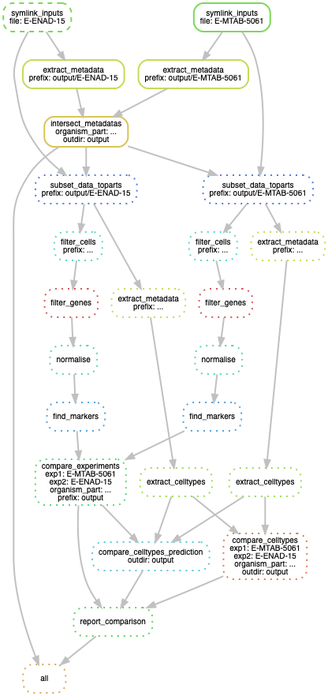

# Comparing cell groupings between experiments across species

In Single-cell Expression Atlas we're interesting in relating cell groupings (clusters, cell types) between experiments and across species boundaries, which we can do via the 'marker' genes of each group. Since each set of marker genes is a product of the context in which it was derived (sorted cell population, sub-tissue, tissue, whole organism), that context must be matched for comparison of marker gene sets (via ortholog relationships) to be valid. With that in mind this workflow will:

 1. Take anndata objects from SCXA analysis for two experiments containing comparable 'organism' parts, even if they're not labelled at the same granularity. 
 2. Match the organism parts beween experiments, using the Uberon ontology to re-label where the granularity of organism part annotation is not consistent.
 3. Subset the experiments to only the common organism parts. 
 4. Re-filter, re-normalise, and re-derive marker genes using Scanpy.
 5. Derive mapped pairs of cell groupings between the two experiments.



## Snakemake workflow

The Snakemake workflow in this repository performs the above steps given the following inputs:

 1. Two annData files with .project.h5ad extensions, stored in an 'inputs' directory  
 2. The two species names
 3. A .obo ontology file in the inputs directory.
 4. An ortholog mapping file in the inputs directory.

Ortholog mappings can be deried from BiomaRt and should look like:

```
homo_sapiens_gene_id	homo_sapiens_gene_name	mus_musculus_gene_id	mus_musculus_gene_name
ENSG00000198888	MT-ND1	ENSMUSG00000064341	mt-Nd1
ENSG00000198763	MT-ND2	ENSMUSG00000064345	mt-Nd2
ENSG00000198804	MT-CO1	ENSMUSG00000064351	mt-Co1
ENSG00000198712	MT-CO2	ENSMUSG00000064354	mt-Co2
ENSG00000198899	MT-ATP6	ENSMUSG00000064357	mt-Atp6
ENSG00000198938	MT-CO3	ENSMUSG00000064358	mt-Co3
ENSG00000198840	MT-ND3	ENSMUSG00000064360	mt-Nd3
ENSG00000212907	MT-ND4L	ENSMUSG00000065947	mt-Nd4l
ENSG00000198886	MT-ND4	ENSMUSG00000064363	mt-Nd4
``` 

So the file should be tab-delimited and have 'gene_id' fields prefixed by the two input species names. 

The Snakemake config file can then be constructed like [the example](config.yaml), and the pipeline run like:

```
Snakemake --use-conda --cores 2
```
