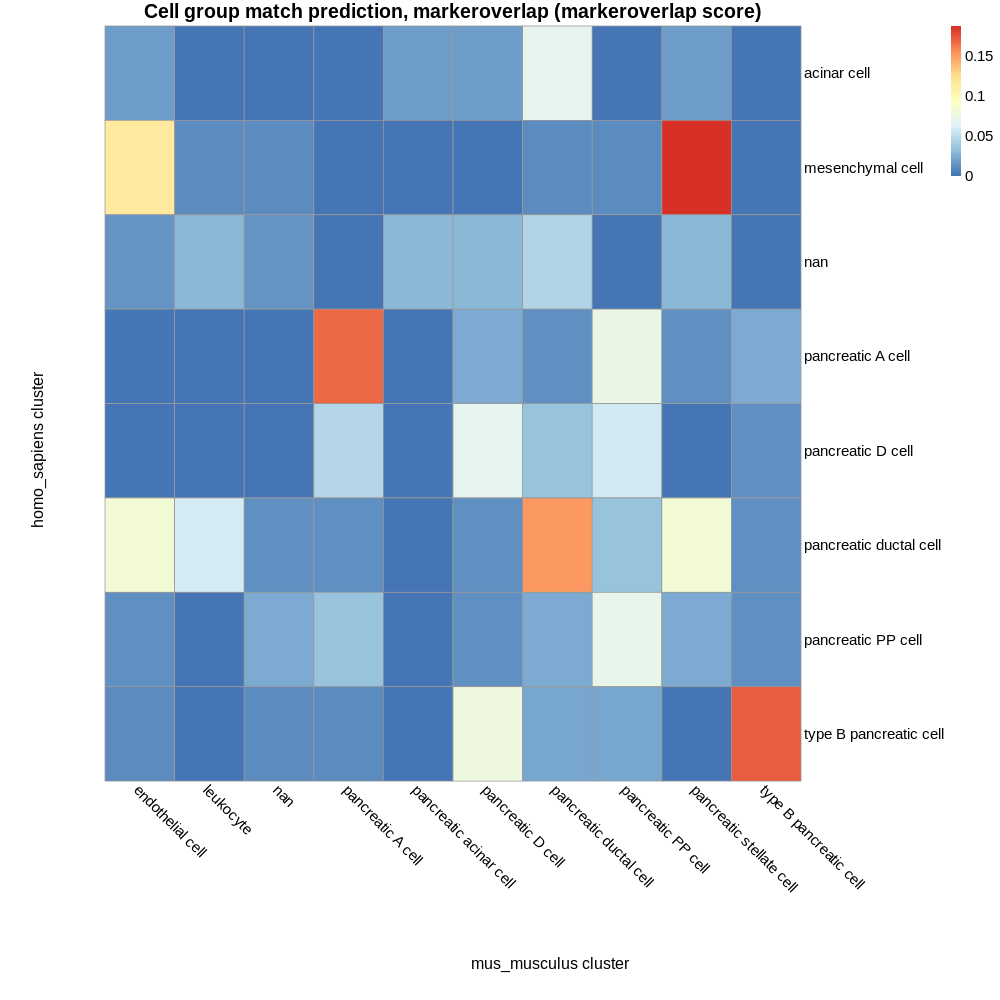
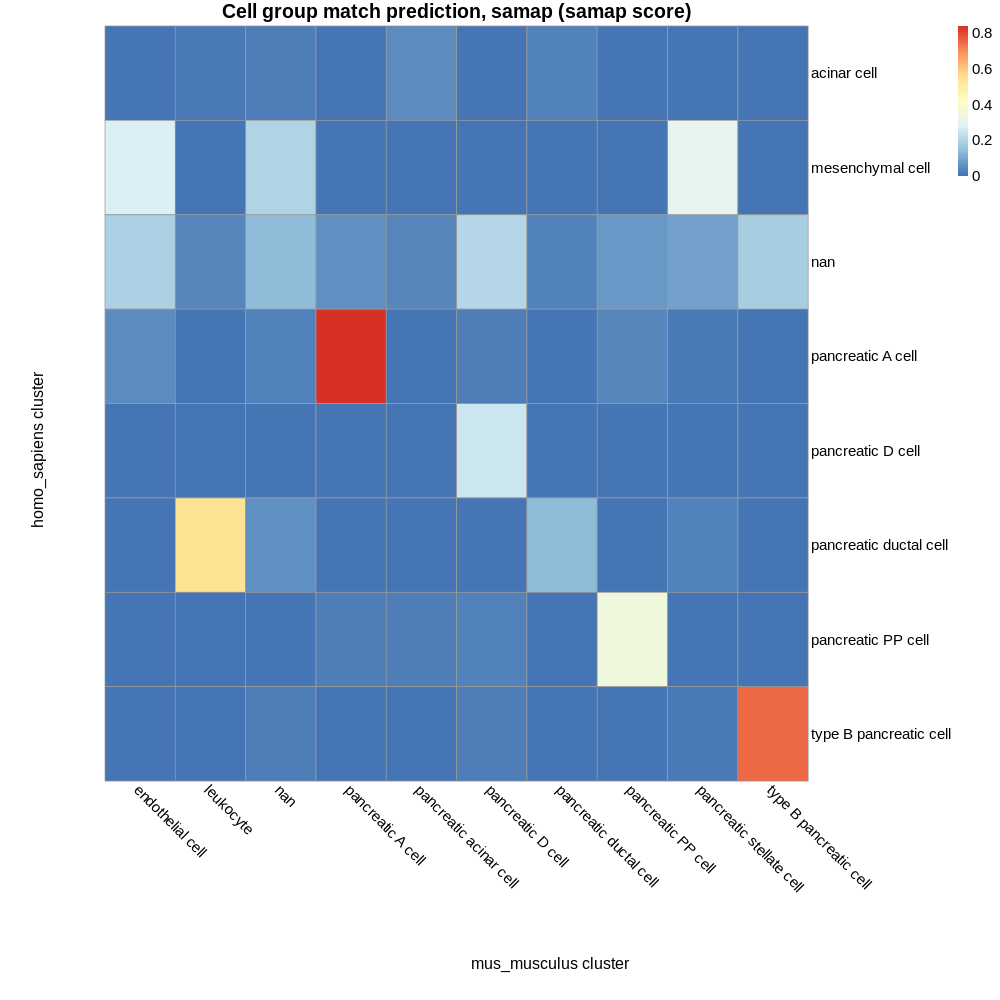

# Known composition of inputs

## E-GEOD-83139 pancreas cell types:

 - acinar cell  
 - mesenchymal cell  
 - nan  
 - pancreatic A cell  
 - pancreatic D cell  
 - pancreatic ductal cell  
 - pancreatic PP cell  
 - type B pancreatic cell  

## E-ENAD-15 pancreas cell types:

 - endothelial cell  
 - leukocyte  
 - nan  
 - pancreatic A cell  
 - pancreatic acinar cell  
 - pancreatic D cell  
 - pancreatic ductal cell  
 - pancreatic PP cell  
 - pancreatic stellate cell  
 - type B pancreatic cell  

## Common cell types:

 - nan  
 - pancreatic A cell  
 - pancreatic D cell  
 - pancreatic ductal cell  
 - pancreatic PP cell  
 - type B pancreatic cell  

# Cell group matches based on marker genes:

## Parameters  

 - Maximum p value: 1  
 - Minimum proportion overlap: 0.05  

## Results 

5 of 6 known intersecting cell types were predicted as top match by marker gene composition:  

pancreatic A cell  
pancreatic D cell  
pancreatic ductal cell  
pancreatic PP cell  
type B pancreatic cell  

5 of 6 known intersecting cell types were predicted as a match (at any rank).  

| homo_sapiens cluster | mus_musculus cluster | intersect_prop | intersect | intersect_gene_ids | intersect_gene_symbols |  
| --- | --- | --- | --- | --- | --- |
| mesenchymal cell | pancreatic stellate cell | 0.1875 | 18 | ENSMUSG00000018593, ENSMUSG00000020044, ENSMUSG00000031502, ENSMUSG00000031503, ENSMUSG00000070436, ENSMUSG00000004044, ENSMUSG00000042284, ENSMUSG00000031375, ENSMUSG00000021760, ENSMUSG00000022816, ENSMUSG00000026043, ENSMUSG00000025491, ENSMUSG00000029761, ENSMUSG00000025492, ENSMUSG00000038146, ENSMUSG00000032766, ENSMUSG00000028464, ENSMUSG00000031616 | Sparc, Timp3, Col4a1, Col4a2, Serpinh1, Cavin1, Itga1, Bgn, Gpx8, Fstl1, Col3a1, Ifitm1, Cald1, Ifitm3, Notch3, Gng11, Tpm2, Ednra |  
| mesenchymal cell | endothelial cell | 0.114583333333333 | 11 | ENSMUSG00000018593, ENSMUSG00000020044, ENSMUSG00000031502, ENSMUSG00000031503, ENSMUSG00000004044, ENSMUSG00000031207, ENSMUSG00000025810, ENSMUSG00000025492, ENSMUSG00000032766, ENSMUSG00000074364, ENSMUSG00000026814 | Sparc, Timp3, Col4a1, Col4a2, Cavin1, Msn, Nrp1, Ifitm3, Gng11, Ehd2, Eng |  
| type B pancreatic cell | type B pancreatic cell | 0.172043010752688 | 16 | ENSMUSG00000041681, ENSMUSG00000000215, ENSMUSG00000027984, ENSMUSG00000021587, ENSMUSG00000005232, ENSMUSG00000057069, ENSMUSG00000022315, ENSMUSG00000022656, ENSMUSG00000039126, ENSMUSG00000020788, ENSMUSG00000029644, ENSMUSG00000024027, ENSMUSG00000047591, ENSMUSG00000035187, ENSMUSG00000005373, ENSMUSG00000024899 | Iapp, Ins2, Hadh, Pcsk1, G6pc2, Ero1lb, Slc30a8, Nectin3, Prune2, Atp2a3, Pdx1, Glp1r, Mafa, Nkx6-1, Mlxipl, Papss2 |  
| type B pancreatic cell | pancreatic D cell | 0.0752688172043011 | 7 | ENSMUSG00000041681, ENSMUSG00000048915, ENSMUSG00000024990, ENSMUSG00000042655, ENSMUSG00000031517, ENSMUSG00000061576, ENSMUSG00000090223 | Iapp, Efna5, Rbp4, Shisal2b, Gpm6a, Dpp6, Pcp4 |  
| pancreatic A cell | pancreatic A cell | 0.168674698795181 | 14 | ENSMUSG00000000394, ENSMUSG00000035540, ENSMUSG00000061808, ENSMUSG00000018339, ENSMUSG00000073530, ENSMUSG00000031596, ENSMUSG00000001504, ENSMUSG00000026103, ENSMUSG00000019577, ENSMUSG00000035277, ENSMUSG00000006546, ENSMUSG00000057614, ENSMUSG00000038412, ENSMUSG00000074622 | Gcg, Gc, Ttr, Gpx3, Pappa2, Slc7a2, Irx2, Gls, Pdk4, Arx, Cryba2, Gnai1, Higd1a, Mafb |  
| pancreatic A cell | pancreatic PP cell | 0.072289156626506 | 6 | ENSMUSG00000035540, ENSMUSG00000018339, ENSMUSG00000073530, ENSMUSG00000001542, ENSMUSG00000035277, ENSMUSG00000040412 | Gc, Gpx3, Pappa2, Ell2, Arx, 5330417C22Rik |  
| pancreatic ductal cell | pancreatic ductal cell | 0.151162790697674 | 13 | ENSMUSG00000029304, ENSMUSG00000022132, ENSMUSG00000014329, ENSMUSG00000029994, ENSMUSG00000028716, ENSMUSG00000008575, ENSMUSG00000021127, ENSMUSG00000020911, ENSMUSG00000000567, ENSMUSG00000037942, ENSMUSG00000032231, ENSMUSG00000023043, ENSMUSG00000049382 | Spp1, Cldn10, Bicc1, Anxa4, Pdzk1ip1, Nfib, Zfp36l1, Krt19, Sox9, Crp, Anxa2, Krt18, Krt8 |  
| pancreatic ductal cell | endothelial cell | 0.0813953488372093 | 7 | ENSMUSG00000025492, ENSMUSG00000066026, ENSMUSG00000008575, ENSMUSG00000027800, ENSMUSG00000056313, ENSMUSG00000032231, ENSMUSG00000028776 | Ifitm3, Dhrs3, Nfib, Tm4sf1, Tcim, Anxa2, Tinagl1 |  
| pancreatic ductal cell | pancreatic stellate cell | 0.0813953488372093 | 7 | ENSMUSG00000023224, ENSMUSG00000025491, ENSMUSG00000025492, ENSMUSG00000032366, ENSMUSG00000027800, ENSMUSG00000021127, ENSMUSG00000028776 | Serping1, Ifitm1, Ifitm3, Tpm1, Tm4sf1, Zfp36l1, Tinagl1 |  
| pancreatic ductal cell | leukocyte | 0.0581395348837209 | 5 | ENSMUSG00000024610, ENSMUSG00000022500, ENSMUSG00000021127, ENSMUSG00000032359, ENSMUSG00000050335 | Cd74, Litaf, Zfp36l1, Ctsh, Lgals3 |  
| pancreatic PP cell | pancreatic PP cell | 0.0697674418604651 | 6 | ENSMUSG00000017316, ENSMUSG00000004151, ENSMUSG00000035277, ENSMUSG00000028222, ENSMUSG00000001542, ENSMUSG00000001901 | Ppy, Etv1, Arx, Calb1, Ell2, Kcnh6 |  
| pancreatic D cell | pancreatic D cell | 0.0689655172413793 | 6 | ENSMUSG00000004366, ENSMUSG00000024990, ENSMUSG00000090223, ENSMUSG00000026579, ENSMUSG00000033676, ENSMUSG00000026360 | Sst, Rbp4, Pcp4, F5, Gabrb3, Rgs2 |  
| pancreatic D cell | pancreatic PP cell | 0.0574712643678161 | 5 | ENSMUSG00000030342, ENSMUSG00000018339, ENSMUSG00000029223, ENSMUSG00000004151, ENSMUSG00000073530 | Cd9, Gpx3, Uchl1, Etv1, Pappa2 |  
| acinar cell | pancreatic ductal cell | 0.0677966101694915 | 4 | ENSMUSG00000024646, ENSMUSG00000049382, ENSMUSG00000023043, ENSMUSG00000008540 | Cyb5a, Krt8, Krt18, Mgst1 |  

# Cell group matches based on SAMap results:

## Parameters  

 - SAMap minimum score threshold: 0.05  

## Results 

4 of 6 known intersecting cell types were predicted as top match by marker gene composition:  

pancreatic A cell  
pancreatic D cell  
pancreatic PP cell  
type B pancreatic cell  

6 of 6 known intersecting cell types were predicted as a match (at any rank).  

| homo_sapiens cluster | mus_musculus cluster | score |  
| --- | --- | --- |
| pancreatic A cell | pancreatic A cell | 0.840269771775861 |  
| type B pancreatic cell | type B pancreatic cell | 0.751306107893955 |  
| pancreatic ductal cell | leukocyte | 0.54348174245399 |  
| pancreatic PP cell | pancreatic PP cell | 0.351844086051575 |  
| mesenchymal cell | pancreatic stellate cell | 0.309953673059399 |  
| mesenchymal cell | endothelial cell | 0.273549406527381 |  
| pancreatic D cell | pancreatic D cell | 0.250213408669875 |  
| nan | pancreatic D cell | 0.202028015232054 |  
| mesenchymal cell | nan | 0.195276892055025 |  
| nan | endothelial cell | 0.189307736839407 |  
| nan | type B pancreatic cell | 0.177684322943551 |  
| pancreatic ductal cell | pancreatic ductal cell | 0.13606531386968 |  
| nan | nan | 0.135498933707604 |  
| nan | pancreatic stellate cell | 0.0886497529424384 |  
| nan | pancreatic PP cell | 0.0727298453267758 |  
| nan | pancreatic A cell | 0.0553928228074687 |  
| pancreatic ductal cell | nan | 0.0513596043911516 |  
