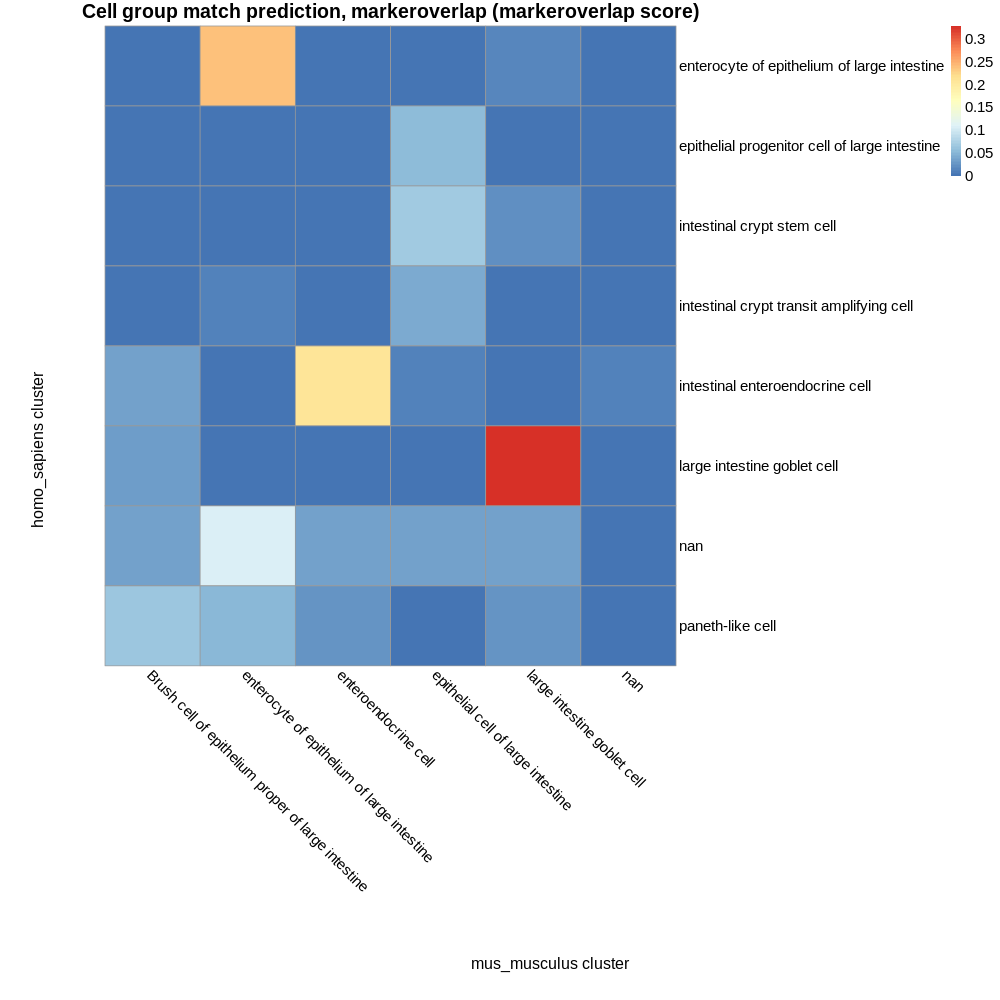
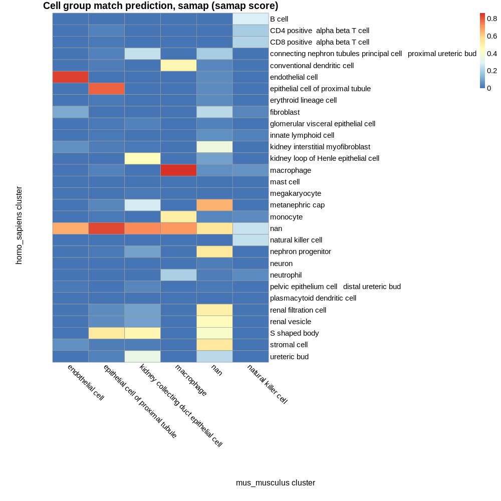

# Known composition of inputs

## E-HCAD-10 kidney cell types:

 - B cell  
 - CD4-positive, alpha-beta T cell  
 - CD8-positive, alpha-beta T cell  
 - connecting nephron tubules/principal cell - proximal ureteric bud  
 - conventional dendritic cell  
 - endothelial cell  
 - epithelial cell of proximal tubule  
 - erythroid lineage cell  
 - fibroblast  
 - glomerular visceral epithelial cell  
 - innate lymphoid cell  
 - kidney interstitial myofibroblast  
 - kidney loop of Henle epithelial cell  
 - macrophage  
 - mast cell  
 - megakaryocyte  
 - metanephric cap  
 - monocyte  
 - nan  
 - natural killer cell  
 - nephron progenitor  
 - neuron  
 - neutrophil  
 - pelvic epithelium cell - distal ureteric bud  
 - plasmacytoid dendritic cell  
 - renal filtration cell  
 - renal vesicle  
 - S shaped body  
 - stromal cell  
 - ureteric bud  

## E-ENAD-15 kidney cell types:

 - endothelial cell  
 - epithelial cell of proximal tubule  
 - kidney collecting duct epithelial cell  
 - macrophage  
 - nan  
 - natural killer cell  

## Common cell types:

 - endothelial cell  
 - epithelial cell of proximal tubule  
 - macrophage  
 - nan  
 - natural killer cell  

# Cell group matches based on marker genes:

## Parameters  

 - Maximum p value: 1  
 - Minimum proportion overlap: 0.05  

## Results 

4 of 5 known intersecting cell types were predicted as top match by marker gene composition:  

endothelial cell  
epithelial cell of proximal tubule  
macrophage  
natural killer cell  

4 of 5 known intersecting cell types were predicted as a match (at any rank).  

| homo_sapiens cluster | mus_musculus cluster | intersect_prop | intersect | intersect_gene_ids | intersect_gene_symbols |  
| --- | --- | --- | --- | --- | --- |
| endothelial cell | endothelial cell | 0.344086021505376 | 32 | ENSMUSG00000034845, ENSMUSG00000001240, ENSMUSG00000026921, ENSMUSG00000001946, ENSMUSG00000027800, ENSMUSG00000031871, ENSMUSG00000032766, ENSMUSG00000001029, ENSMUSG00000016494, ENSMUSG00000029648, ENSMUSG00000026185, ENSMUSG00000056313, ENSMUSG00000028517, ENSMUSG00000062960, ENSMUSG00000033191, ENSMUSG00000039167, ENSMUSG00000006356, ENSMUSG00000059588, ENSMUSG00000054690, ENSMUSG00000027435, ENSMUSG00000056492, ENSMUSG00000002504, ENSMUSG00000020315, ENSMUSG00000026814, ENSMUSG00000021701, ENSMUSG00000006386, ENSMUSG00000020154, ENSMUSG00000041445, ENSMUSG00000032035, ENSMUSG00000031502, ENSMUSG00000053477, ENSMUSG00000054435 | Plvap, Ramp2, Egfl7, Esam, Tm4sf1, Cdh5, Gng11, Icam2, Cd34, Flt1, Igfbp5, Tcim, Plpp3, Kdr, Tie1, Adgrl4, Crip2, Calcrl, Emcn, Cd93, Adgrf5, Slc9a3r2, Sptbn1, Eng, Plk2, Tek, Ptprb, Mmrn2, Ets1, Col4a1, Tcf4, Gimap4 |  
| conventional dendritic cell | macrophage | 0.333333333333333 | 26 | ENSMUSG00000073421, ENSMUSG00000024610, ENSMUSG00000024397, ENSMUSG00000037649, ENSMUSG00000030844, ENSMUSG00000030707, ENSMUSG00000020077, ENSMUSG00000030579, ENSMUSG00000040950, ENSMUSG00000058715, ENSMUSG00000002111, ENSMUSG00000031827, ENSMUSG00000021423, ENSMUSG00000021998, ENSMUSG00000052160, ENSMUSG00000028581, ENSMUSG00000026395, ENSMUSG00000038642, ENSMUSG00000022831, ENSMUSG00000000290, ENSMUSG00000032359, ENSMUSG00000028843, ENSMUSG00000060063, ENSMUSG00000040747, ENSMUSG00000020101, ENSMUSG00000060802 | H2-Ab1, Cd74, Aif1, H2-DMa, Rgs10, Coro1a, Srgn, Tyrobp, Mgl2, Fcer1g, Spi1, Cotl1, Ly86, Lcp1, Pld4, Laptm5, Ptprc, Ctss, Hcls1, Itgb2, Ctsh, Sh3bgrl3, Alox5ap, Cd53, Vsir, B2m |  
| conventional dendritic cell | natural killer cell | 0.192307692307692 | 15 | ENSMUSG00000027639, ENSMUSG00000030707, ENSMUSG00000020077, ENSMUSG00000030220, ENSMUSG00000030798, ENSMUSG00000022378, ENSMUSG00000021998, ENSMUSG00000028581, ENSMUSG00000026395, ENSMUSG00000006360, ENSMUSG00000028843, ENSMUSG00000040747, ENSMUSG00000026832, ENSMUSG00000033220, ENSMUSG00000060802 | Samhd1, Coro1a, Srgn, Arhgdib, Cd37, Fam49b, Lcp1, Laptm5, Ptprc, Crip1, Sh3bgrl3, Cd53, Cytip, Rac2, B2m |  
| macrophage | macrophage | 0.302325581395349 | 26 | ENSMUSG00000036887, ENSMUSG00000036896, ENSMUSG00000030579, ENSMUSG00000024397, ENSMUSG00000036905, ENSMUSG00000058715, ENSMUSG00000020077, ENSMUSG00000024621, ENSMUSG00000051439, ENSMUSG00000024610, ENSMUSG00000030844, ENSMUSG00000015340, ENSMUSG00000028581, ENSMUSG00000021242, ENSMUSG00000052160, ENSMUSG00000060063, ENSMUSG00000038642, ENSMUSG00000000290, ENSMUSG00000002111, ENSMUSG00000030707, ENSMUSG00000033685, ENSMUSG00000021423, ENSMUSG00000060802, ENSMUSG00000037649, ENSMUSG00000060216, ENSMUSG00000046805 | C1qa, C1qc, Tyrobp, Aif1, C1qb, Fcer1g, Srgn, Csf1r, Cd14, Cd74, Rgs10, Cybb, Laptm5, Npc2, Pld4, Alox5ap, Ctss, Itgb2, Spi1, Coro1a, Ucp2, Ly86, B2m, H2-DMa, Arrb2, Mpeg1 |  
| macrophage | natural killer cell | 0.0697674418604651 | 6 | ENSMUSG00000020077, ENSMUSG00000028581, ENSMUSG00000030220, ENSMUSG00000030707, ENSMUSG00000027639, ENSMUSG00000060802 | Srgn, Laptm5, Arhgdib, Coro1a, Samhd1, B2m |  
| epithelial cell of proximal tubule | epithelial cell of proximal tubule | 0.258064516129032 | 24 | ENSMUSG00000018339, ENSMUSG00000059412, ENSMUSG00000038298, ENSMUSG00000022323, ENSMUSG00000031938, ENSMUSG00000027070, ENSMUSG00000063683, ENSMUSG00000062609, ENSMUSG00000025059, ENSMUSG00000076441, ENSMUSG00000021238, ENSMUSG00000040181, ENSMUSG00000021490, ENSMUSG00000027199, ENSMUSG00000004610, ENSMUSG00000030945, ENSMUSG00000024646, ENSMUSG00000021947, ENSMUSG00000027513, ENSMUSG00000001827, ENSMUSG00000027359, ENSMUSG00000005125, ENSMUSG00000054428, ENSMUSG00000022821 | Gpx3, Fxyd2, Pdzk1, Rida, 4931406C07Rik, Lrp2, Glyat, Kcnj15, Gk, Ass1, Aldh6a1, Fmo1, Slc34a1, Gatm, Etfb, Acsm2, Cyb5a, Cryl1, Pck1, Folr1, Slc27a2, Ndrg1, Atpif1, Hgd |  
| epithelial cell of proximal tubule | kidney collecting duct epithelial cell | 0.0645161290322581 | 6 | ENSMUSG00000059412, ENSMUSG00000031765, ENSMUSG00000026568, ENSMUSG00000029304, ENSMUSG00000026576, ENSMUSG00000031881 | Fxyd2, Mt1, Mpc2, Spp1, Atp1b1, Cdh16 |  
| monocyte | macrophage | 0.246913580246914 | 20 | ENSMUSG00000030579, ENSMUSG00000038642, ENSMUSG00000024397, ENSMUSG00000058715, ENSMUSG00000020077, ENSMUSG00000030707, ENSMUSG00000024610, ENSMUSG00000021998, ENSMUSG00000031827, ENSMUSG00000015340, ENSMUSG00000028581, ENSMUSG00000028843, ENSMUSG00000020101, ENSMUSG00000002111, ENSMUSG00000000290, ENSMUSG00000026395, ENSMUSG00000021423, ENSMUSG00000060802, ENSMUSG00000051439, ENSMUSG00000046805 | Tyrobp, Ctss, Aif1, Fcer1g, Srgn, Coro1a, Cd74, Lcp1, Cotl1, Cybb, Laptm5, Sh3bgrl3, Vsir, Spi1, Itgb2, Ptprc, Ly86, B2m, Cd14, Mpeg1 |  
| monocyte | natural killer cell | 0.148148148148148 | 12 | ENSMUSG00000020077, ENSMUSG00000030707, ENSMUSG00000030798, ENSMUSG00000021998, ENSMUSG00000030220, ENSMUSG00000027639, ENSMUSG00000028581, ENSMUSG00000028843, ENSMUSG00000026395, ENSMUSG00000040212, ENSMUSG00000060802, ENSMUSG00000068220 | Srgn, Coro1a, Cd37, Lcp1, Arhgdib, Samhd1, Laptm5, Sh3bgrl3, Ptprc, Emp3, B2m, Lgals1 |  
| kidney loop of Henle epithelial cell | kidney collecting duct epithelial cell | 0.235955056179775 | 21 | ENSMUSG00000027375, ENSMUSG00000059412, ENSMUSG00000027202, ENSMUSG00000026576, ENSMUSG00000041248, ENSMUSG00000033161, ENSMUSG00000031881, ENSMUSG00000001270, ENSMUSG00000033770, ENSMUSG00000023861, ENSMUSG00000036256, ENSMUSG00000027102, ENSMUSG00000028773, ENSMUSG00000029829, ENSMUSG00000045394, ENSMUSG00000017009, ENSMUSG00000026568, ENSMUSG00000030541, ENSMUSG00000020340, ENSMUSG00000032278, ENSMUSG00000025927 | Mal, Fxyd2, Slc12a1, Atp1b1, Kcnj1, Atp1a1, Cdh16, Ckb, Clcnka, Mpc1, Igfbp7, Hoxd8, Fabp3, Tmem213, Epcam, Sdc4, Mpc2, Idh2, Cyfip2, Paqr5, Tfap2b |  
| CD4-positive, alpha-beta T cell | natural killer cell | 0.222222222222222 | 18 | ENSMUSG00000032035, ENSMUSG00000026395, ENSMUSG00000033220, ENSMUSG00000030707, ENSMUSG00000030220, ENSMUSG00000031304, ENSMUSG00000030798, ENSMUSG00000006360, ENSMUSG00000027863, ENSMUSG00000026832, ENSMUSG00000028581, ENSMUSG00000060802, ENSMUSG00000026094, ENSMUSG00000021998, ENSMUSG00000028530, ENSMUSG00000000486, ENSMUSG00000020077, ENSMUSG00000040747 | Ets1, Ptprc, Rac2, Coro1a, Arhgdib, Il2rg, Cd37, Crip1, Cd2, Cytip, Laptm5, B2m, Stk17b, Lcp1, Jak1, Septin1, Srgn, Cd53 |  
| CD4-positive, alpha-beta T cell | macrophage | 0.123456790123457 | 10 | ENSMUSG00000026395, ENSMUSG00000030707, ENSMUSG00000022148, ENSMUSG00000028581, ENSMUSG00000030844, ENSMUSG00000060802, ENSMUSG00000021998, ENSMUSG00000033685, ENSMUSG00000020077, ENSMUSG00000040747 | Ptprc, Coro1a, Fyb, Laptm5, Rgs10, B2m, Lcp1, Ucp2, Srgn, Cd53 |  
| CD8-positive, alpha-beta T cell | natural killer cell | 0.219178082191781 | 16 | ENSMUSG00000030220, ENSMUSG00000030707, ENSMUSG00000020077, ENSMUSG00000032035, ENSMUSG00000026395, ENSMUSG00000033220, ENSMUSG00000045826, ENSMUSG00000031304, ENSMUSG00000060802, ENSMUSG00000021998, ENSMUSG00000028581, ENSMUSG00000036478, ENSMUSG00000018293, ENSMUSG00000006360, ENSMUSG00000030798, ENSMUSG00000027863 | Arhgdib, Coro1a, Srgn, Ets1, Ptprc, Rac2, Ptprcap, Il2rg, B2m, Lcp1, Laptm5, Btg1, Pfn1, Crip1, Cd37, Cd2 |  
| CD8-positive, alpha-beta T cell | macrophage | 0.0958904109589041 | 7 | ENSMUSG00000030707, ENSMUSG00000020077, ENSMUSG00000026395, ENSMUSG00000060802, ENSMUSG00000021998, ENSMUSG00000028581, ENSMUSG00000022148 | Coro1a, Srgn, Ptprc, B2m, Lcp1, Laptm5, Fyb |  
| CD8-positive, alpha-beta T cell | endothelial cell | 0.0547945205479452 | 4 | ENSMUSG00000020077, ENSMUSG00000032035, ENSMUSG00000060802, ENSMUSG00000054435 | Srgn, Ets1, B2m, Gimap4 |  
| neutrophil | macrophage | 0.207792207792208 | 16 | ENSMUSG00000089929, ENSMUSG00000030579, ENSMUSG00000058715, ENSMUSG00000020077, ENSMUSG00000024397, ENSMUSG00000038642, ENSMUSG00000028843, ENSMUSG00000051439, ENSMUSG00000060063, ENSMUSG00000030707, ENSMUSG00000060802, ENSMUSG00000020101, ENSMUSG00000028581, ENSMUSG00000074622, ENSMUSG00000020120, ENSMUSG00000002111 | Bcl2a1b, Tyrobp, Fcer1g, Srgn, Aif1, Ctss, Sh3bgrl3, Cd14, Alox5ap, Coro1a, B2m, Vsir, Laptm5, Mafb, Plek, Spi1 |  
| neutrophil | natural killer cell | 0.12987012987013 | 10 | ENSMUSG00000020077, ENSMUSG00000028843, ENSMUSG00000030798, ENSMUSG00000030707, ENSMUSG00000060802, ENSMUSG00000036478, ENSMUSG00000028581, ENSMUSG00000040212, ENSMUSG00000071076, ENSMUSG00000018293 | Srgn, Sh3bgrl3, Cd37, Coro1a, B2m, Btg1, Laptm5, Emp3, Jund, Pfn1 |  
| natural killer cell | natural killer cell | 0.184210526315789 | 14 | ENSMUSG00000026395, ENSMUSG00000045826, ENSMUSG00000020077, ENSMUSG00000031304, ENSMUSG00000033220, ENSMUSG00000030707, ENSMUSG00000030220, ENSMUSG00000032035, ENSMUSG00000021998, ENSMUSG00000060802, ENSMUSG00000028530, ENSMUSG00000006360, ENSMUSG00000040747, ENSMUSG00000026832 | Ptprc, Ptprcap, Srgn, Il2rg, Rac2, Coro1a, Arhgdib, Ets1, Lcp1, B2m, Jak1, Crip1, Cd53, Cytip |  
| natural killer cell | macrophage | 0.157894736842105 | 12 | ENSMUSG00000026395, ENSMUSG00000030579, ENSMUSG00000020077, ENSMUSG00000030707, ENSMUSG00000058715, ENSMUSG00000060063, ENSMUSG00000021998, ENSMUSG00000000290, ENSMUSG00000060802, ENSMUSG00000059089, ENSMUSG00000040747, ENSMUSG00000020120 | Ptprc, Tyrobp, Srgn, Coro1a, Fcer1g, Alox5ap, Lcp1, Itgb2, B2m, Fcgr4, Cd53, Plek |  
| natural killer cell | endothelial cell | 0.0526315789473684 | 4 | ENSMUSG00000020077, ENSMUSG00000032035, ENSMUSG00000060802, ENSMUSG00000054435 | Srgn, Ets1, B2m, Gimap4 |  
| plasmacytoid dendritic cell | macrophage | 0.146341463414634 | 12 | ENSMUSG00000024610, ENSMUSG00000052160, ENSMUSG00000058715, ENSMUSG00000030579, ENSMUSG00000060063, ENSMUSG00000018008, ENSMUSG00000030707, ENSMUSG00000060802, ENSMUSG00000037649, ENSMUSG00000024397, ENSMUSG00000038642, ENSMUSG00000020077 | Cd74, Pld4, Fcer1g, Tyrobp, Alox5ap, Cyth4, Coro1a, B2m, H2-DMa, Aif1, Ctss, Srgn |  
| plasmacytoid dendritic cell | natural killer cell | 0.0975609756097561 | 8 | ENSMUSG00000030798, ENSMUSG00000020255, ENSMUSG00000030707, ENSMUSG00000027639, ENSMUSG00000060802, ENSMUSG00000006360, ENSMUSG00000033220, ENSMUSG00000020077 | Cd37, D10Wsu102e, Coro1a, Samhd1, B2m, Crip1, Rac2, Srgn |  
| innate lymphoid cell | natural killer cell | 0.141025641025641 | 11 | ENSMUSG00000030220, ENSMUSG00000031304, ENSMUSG00000020077, ENSMUSG00000030707, ENSMUSG00000033220, ENSMUSG00000021998, ENSMUSG00000002107, ENSMUSG00000030798, ENSMUSG00000045826, ENSMUSG00000026395, ENSMUSG00000040747 | Arhgdib, Il2rg, Srgn, Coro1a, Rac2, Lcp1, Celf2, Cd37, Ptprcap, Ptprc, Cd53 |  
| innate lymphoid cell | macrophage | 0.0897435897435897 | 7 | ENSMUSG00000020077, ENSMUSG00000030707, ENSMUSG00000021998, ENSMUSG00000026395, ENSMUSG00000040747, ENSMUSG00000075415, ENSMUSG00000024610 | Srgn, Coro1a, Lcp1, Ptprc, Cd53, Fnbp1, Cd74 |  
| B cell | macrophage | 0.140845070422535 | 10 | ENSMUSG00000028581, ENSMUSG00000024610, ENSMUSG00000060802, ENSMUSG00000030707, ENSMUSG00000033685, ENSMUSG00000028459, ENSMUSG00000040747, ENSMUSG00000073421, ENSMUSG00000037649, ENSMUSG00000026395 | Laptm5, Cd74, B2m, Coro1a, Ucp2, Cd72, Cd53, H2-Ab1, H2-DMa, Ptprc |  
| B cell | natural killer cell | 0.126760563380282 | 9 | ENSMUSG00000030798, ENSMUSG00000028581, ENSMUSG00000030220, ENSMUSG00000045826, ENSMUSG00000060802, ENSMUSG00000030707, ENSMUSG00000033220, ENSMUSG00000040747, ENSMUSG00000026395 | Cd37, Laptm5, Arhgdib, Ptprcap, B2m, Coro1a, Rac2, Cd53, Ptprc |  
| ureteric bud | kidney collecting duct epithelial cell | 0.131868131868132 | 12 | ENSMUSG00000027375, ENSMUSG00000030160, ENSMUSG00000045394, ENSMUSG00000026568, ENSMUSG00000026576, ENSMUSG00000036256, ENSMUSG00000074227, ENSMUSG00000027102, ENSMUSG00000059412, ENSMUSG00000033161, ENSMUSG00000017009, ENSMUSG00000001864 | Mal, Tmem52b, Epcam, Mpc2, Atp1b1, Igfbp7, Spint2, Hoxd8, Fxyd2, Atp1a1, Sdc4, Aif1l |  
| mast cell | macrophage | 0.121951219512195 | 10 | ENSMUSG00000060063, ENSMUSG00000020077, ENSMUSG00000028581, ENSMUSG00000058715, ENSMUSG00000030579, ENSMUSG00000028843, ENSMUSG00000031613, ENSMUSG00000040747, ENSMUSG00000060802, ENSMUSG00000021998 | Alox5ap, Srgn, Laptm5, Fcer1g, Tyrobp, Sh3bgrl3, Hpgd, Cd53, B2m, Lcp1 |  
| mast cell | natural killer cell | 0.121951219512195 | 10 | ENSMUSG00000020077, ENSMUSG00000028581, ENSMUSG00000030220, ENSMUSG00000033220, ENSMUSG00000040212, ENSMUSG00000030798, ENSMUSG00000028843, ENSMUSG00000040747, ENSMUSG00000060802, ENSMUSG00000021998 | Srgn, Laptm5, Arhgdib, Rac2, Emp3, Cd37, Sh3bgrl3, Cd53, B2m, Lcp1 |  
| S shaped body | kidney collecting duct epithelial cell | 0.108695652173913 | 10 | ENSMUSG00000074227, ENSMUSG00000059412, ENSMUSG00000001864, ENSMUSG00000045394, ENSMUSG00000026568, ENSMUSG00000001270, ENSMUSG00000027375, ENSMUSG00000026576, ENSMUSG00000031881, ENSMUSG00000017009 | Spint2, Fxyd2, Aif1l, Epcam, Mpc2, Ckb, Mal, Atp1b1, Cdh16, Sdc4 |  
| S shaped body | epithelial cell of proximal tubule | 0.0760869565217391 | 7 | ENSMUSG00000059412, ENSMUSG00000022323, ENSMUSG00000038298, ENSMUSG00000027359, ENSMUSG00000031938, ENSMUSG00000076441, ENSMUSG00000024646 | Fxyd2, Rida, Pdzk1, Slc27a2, 4931406C07Rik, Ass1, Cyb5a |  
| kidney interstitial myofibroblast | endothelial cell | 0.0833333333333333 | 8 | ENSMUSG00000026814, ENSMUSG00000029761, ENSMUSG00000028776, ENSMUSG00000054690, ENSMUSG00000031502, ENSMUSG00000018593, ENSMUSG00000006356, ENSMUSG00000027800 | Eng, Cald1, Tinagl1, Emcn, Col4a1, Sparc, Crip2, Tm4sf1 |  
| stromal cell | endothelial cell | 0.0824742268041237 | 8 | ENSMUSG00000054690, ENSMUSG00000029761, ENSMUSG00000027210, ENSMUSG00000052534, ENSMUSG00000025492, ENSMUSG00000018593, ENSMUSG00000022122, ENSMUSG00000031502 | Emcn, Cald1, Meis2, Pbx1, Ifitm3, Sparc, Ednrb, Col4a1 |  

# Cell group matches based on SAMap results:

## Parameters  

 - SAMap minimum score threshold: 0.05  

## Results 

4 of 5 known intersecting cell types were predicted as top match by marker gene composition:  

endothelial cell  
epithelial cell of proximal tubule  
macrophage  
natural killer cell  

5 of 5 known intersecting cell types were predicted as a match (at any rank).  

| homo_sapiens cluster | mus_musculus cluster | score |  
| --- | --- | --- |
| macrophage | macrophage | 0.864031170087212 |  
| endothelial cell | endothelial cell | 0.832628460876132 |  
| nan | epithelial cell of proximal tubule | 0.822935036398423 |  
| epithelial cell of proximal tubule | epithelial cell of proximal tubule | 0.779747823447767 |  
| nan | kidney collecting duct epithelial cell | 0.718377815910027 |  
| nan | macrophage | 0.691535655793616 |  
| nan | endothelial cell | 0.66382489957535 |  
| metanephric cap | nan | 0.652905358618157 |  
| nan | nan | 0.540165800977411 |  
| stromal cell | nan | 0.533653078582924 |  
| nephron progenitor | nan | 0.531221351931604 |  
| S shaped body | epithelial cell of proximal tubule | 0.525282551800779 |  
| monocyte | macrophage | 0.506911816349585 |  
| renal filtration cell | nan | 0.499808285186166 |  
| conventional dendritic cell | macrophage | 0.473652281577807 |  
| S shaped body | kidney collecting duct epithelial cell | 0.468459316365327 |  
| renal vesicle | nan | 0.44069313697162 |  
| kidney loop of Henle epithelial cell | kidney collecting duct epithelial cell | 0.436003058709498 |  
| S shaped body | nan | 0.398878106684482 |  
| kidney interstitial myofibroblast | nan | 0.348916075724932 |  
| ureteric bud | kidney collecting duct epithelial cell | 0.336026758581974 |  
| B cell | natural killer cell | 0.284271468796435 |  
| metanephric cap | kidney collecting duct epithelial cell | 0.269054423011031 |  
| nan | natural killer cell | 0.249414493507676 |  
| connecting nephron tubules principal cell   proximal ureteric bud | kidney collecting duct epithelial cell | 0.234868772063569 |  
| natural killer cell | natural killer cell | 0.234770800591646 |  
| fibroblast | nan | 0.223267131818293 |  
| ureteric bud | nan | 0.216384680436788 |  
| CD8 positive  alpha beta T cell | natural killer cell | 0.204969904359069 |  
| neutrophil | macrophage | 0.194659732393124 |  
| CD4 positive  alpha beta T cell | natural killer cell | 0.186158936719966 |  
| connecting nephron tubules principal cell   proximal ureteric bud | nan | 0.181592096742284 |  
| fibroblast | endothelial cell | 0.107969927720155 |  
| nephron progenitor | kidney collecting duct epithelial cell | 0.0946409888985012 |  
| renal filtration cell | kidney collecting duct epithelial cell | 0.0890710641550995 |  
| kidney loop of Henle epithelial cell | nan | 0.0889830656897904 |  
| renal vesicle | kidney collecting duct epithelial cell | 0.0874152719258412 |  
| macrophage | natural killer cell | 0.0624078843124086 |  
| innate lymphoid cell | nan | 0.0588393355182796 |  
| kidney interstitial myofibroblast | endothelial cell | 0.0587685408021384 |  
| stromal cell | endothelial cell | 0.0536090275413506 |  
| macrophage | nan | 0.0528529878199039 |  
| renal vesicle | epithelial cell of proximal tubule | 0.0505086224510961 |  
