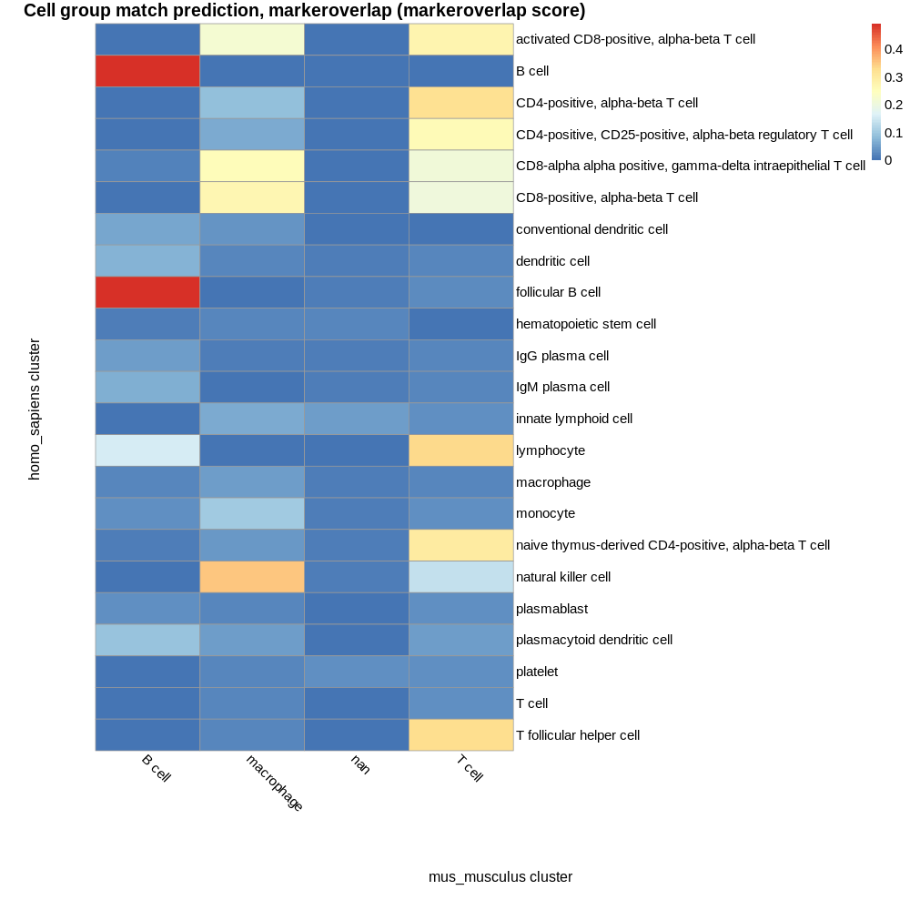
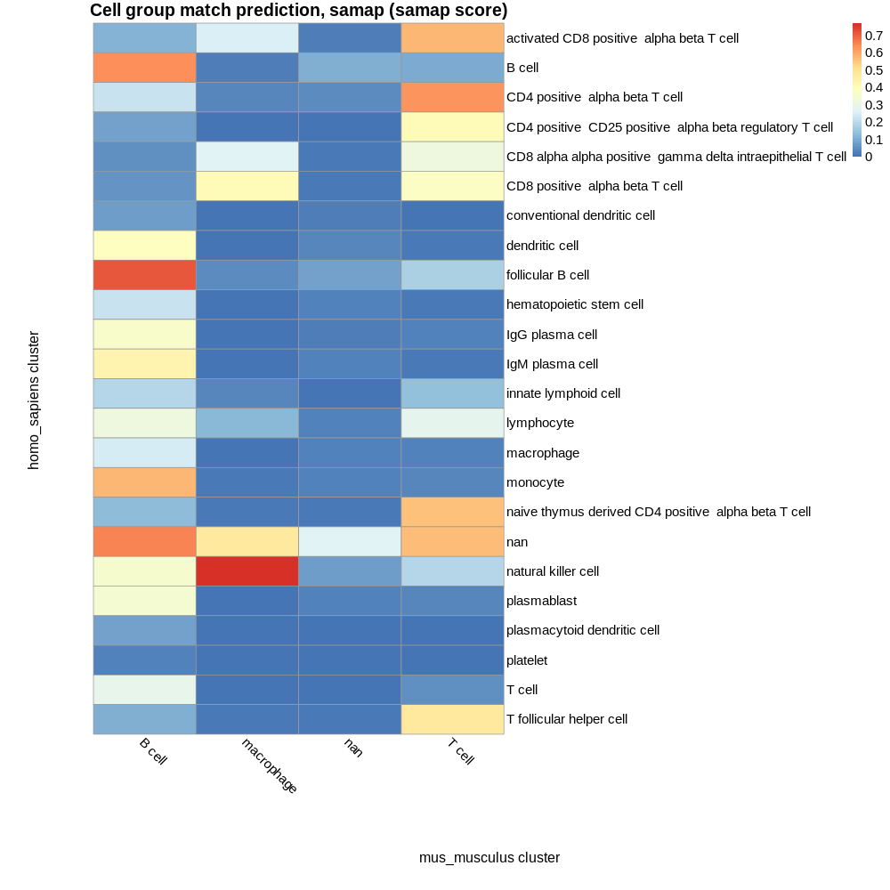

# Known composition of inputs

## E-HCAD-1 spleen cell types:

 - activated CD8-positive, alpha-beta T cell  
 - B cell  
 - CD4-positive, alpha-beta T cell  
 - CD4-positive, CD25-positive, alpha-beta regulatory T cell  
 - CD8-alpha alpha positive, gamma-delta intraepithelial T cell  
 - CD8-positive, alpha-beta T cell  
 - conventional dendritic cell  
 - dendritic cell  
 - follicular B cell  
 - hematopoietic stem cell  
 - IgG plasma cell  
 - IgM plasma cell  
 - innate lymphoid cell  
 - lymphocyte  
 - macrophage  
 - monocyte  
 - naive thymus-derived CD4-positive, alpha-beta T cell  
 - nan  
 - natural killer cell  
 - plasmablast  
 - plasmacytoid dendritic cell  
 - platelet  
 - T cell  
 - T follicular helper cell  

## E-ENAD-15 spleen cell types:

 - B cell  
 - macrophage  
 - nan  
 - T cell  

## Common cell types:

 - B cell  
 - macrophage  
 - nan  
 - T cell  

# Cell group matches based on marker genes:

## Parameters  

 - Maximum p value: 1  
 - Minimum proportion overlap: 0.05  

## Results 

1 of 4 known intersecting cell types were predicted as top match by marker gene composition:  

B cell  

1 of 4 known intersecting cell types were predicted as a match (at any rank).  

| homo_sapiens cluster | mus_musculus cluster | intersect_prop | intersect | intersect_gene_ids | intersect_gene_symbols |  
| --- | --- | --- | --- | --- | --- |
| follicular B cell | B cell | 0.492753623188406 | 34 | ENSMUSG00000024673, ENSMUSG00000003379, ENSMUSG00000000903, ENSMUSG00000073421, ENSMUSG00000037922, ENSMUSG00000024610, ENSMUSG00000040592, ENSMUSG00000021423, ENSMUSG00000037822, ENSMUSG00000068105, ENSMUSG00000030798, ENSMUSG00000030577, ENSMUSG00000000861, ENSMUSG00000030724, ENSMUSG00000026616, ENSMUSG00000041515, ENSMUSG00000038421, ENSMUSG00000014453, ENSMUSG00000037649, ENSMUSG00000049422, ENSMUSG00000061132, ENSMUSG00000037548, ENSMUSG00000036469, ENSMUSG00000029322, ENSMUSG00000031015, ENSMUSG00000026594, ENSMUSG00000008496, ENSMUSG00000032053, ENSMUSG00000032359, ENSMUSG00000008193, ENSMUSG00000041538, ENSMUSG00000005583, ENSMUSG00000035268, ENSMUSG00000031264 | Ms4a1, Cd79a, Vpreb3, H2-Ab1, Bank1, Cd74, Cd79b, Ly86, Smim14, Tnfrsf13c, Cd37, Cd22, Bcl11a, Cd19, Cr2, Irf8, Fcrla, Blk, H2-DMa, Chchd10, Blnk, H2-DMb2, Marchf1, Plac8, Swap70, Ralgps2, Pou2f2, Pou2af1, Ctsh, Spib, H2-Ob, Mef2c, Pkig, Btk |  
| B cell | B cell | 0.491228070175439 | 28 | ENSMUSG00000024673, ENSMUSG00000003379, ENSMUSG00000040592, ENSMUSG00000024610, ENSMUSG00000076617, ENSMUSG00000073421, ENSMUSG00000030798, ENSMUSG00000005540, ENSMUSG00000000903, ENSMUSG00000021880, ENSMUSG00000037548, ENSMUSG00000037649, ENSMUSG00000064267, ENSMUSG00000037922, ENSMUSG00000030577, ENSMUSG00000000861, ENSMUSG00000036469, ENSMUSG00000005583, ENSMUSG00000041538, ENSMUSG00000041515, ENSMUSG00000038421, ENSMUSG00000068105, ENSMUSG00000034484, ENSMUSG00000030724, ENSMUSG00000014453, ENSMUSG00000008193, ENSMUSG00000031015, ENSMUSG00000026594 | Ms4a1, Cd79a, Cd79b, Cd74, Ighm, H2-Ab1, Cd37, Fcer2a, Vpreb3, Rnase6, H2-DMb2, H2-DMa, Hvcn1, Bank1, Cd22, Bcl11a, Marchf1, Mef2c, H2-Ob, Irf8, Fcrla, Tnfrsf13c, Snx2, Cd19, Blk, Spib, Swap70, Ralgps2 |  
| natural killer cell | macrophage | 0.353658536585366 | 29 | ENSMUSG00000004612, ENSMUSG00000030165, ENSMUSG00000030579, ENSMUSG00000058715, ENSMUSG00000037202, ENSMUSG00000023132, ENSMUSG00000024910, ENSMUSG00000068129, ENSMUSG00000020644, ENSMUSG00000015437, ENSMUSG00000030149, ENSMUSG00000000982, ENSMUSG00000064109, ENSMUSG00000035042, ENSMUSG00000068227, ENSMUSG00000054892, ENSMUSG00000000290, ENSMUSG00000051354, ENSMUSG00000041831, ENSMUSG00000045087, ENSMUSG00000007891, ENSMUSG00000024300, ENSMUSG00000098112, ENSMUSG00000032446, ENSMUSG00000001444, ENSMUSG00000000817, ENSMUSG00000019843, ENSMUSG00000040659, ENSMUSG00000062524 | Nkg7, Klrd1, Tyrobp, Fcer1g, Prf1, Gzma, Ctsw, Cst7, Id2, Gzmb, Klrk1, Ccl3, Hcst, Ccl5, Il2rb, Txk, Itgb2, Samd3, Sytl3, S1pr5, Ctsd, Myo1f, Bin2, Eomes, Tbx21, Fasl, Fyn, Efhd2, Ncr1 |  
| natural killer cell | T cell | 0.134146341463415 | 11 | ENSMUSG00000004612, ENSMUSG00000024910, ENSMUSG00000005763, ENSMUSG00000064109, ENSMUSG00000068227, ENSMUSG00000054892, ENSMUSG00000007891, ENSMUSG00000005696, ENSMUSG00000021108, ENSMUSG00000076498, ENSMUSG00000019843 | Nkg7, Ctsw, Cd247, Hcst, Il2rb, Txk, Ctsd, Sh2d1a, Prkch, Trbc2, Fyn |  
| lymphocyte | T cell | 0.333333333333333 | 13 | ENSMUSG00000003882, ENSMUSG00000032094, ENSMUSG00000032093, ENSMUSG00000031532, ENSMUSG00000027863, ENSMUSG00000048251, ENSMUSG00000022148, ENSMUSG00000002033, ENSMUSG00000076498, ENSMUSG00000031513, ENSMUSG00000030775, ENSMUSG00000027985, ENSMUSG00000000782 | Il7r, Cd3d, Cd3e, Saraf, Cd2, Bcl11b, Fyb, Cd3g, Trbc2, Leprotl1, Trat1, Lef1, Tcf7 |  
| lymphocyte | B cell | 0.153846153846154 | 6 | ENSMUSG00000076617, ENSMUSG00000003379, ENSMUSG00000024673, ENSMUSG00000076609, ENSMUSG00000040592, ENSMUSG00000073421 | Ighm, Cd79a, Ms4a1, Igkc, Cd79b, H2-Ab1 |  
| T follicular helper cell | T cell | 0.325301204819277 | 27 | ENSMUSG00000032094, ENSMUSG00000022148, ENSMUSG00000032093, ENSMUSG00000003882, ENSMUSG00000027863, ENSMUSG00000002033, ENSMUSG00000076498, ENSMUSG00000048251, ENSMUSG00000000782, ENSMUSG00000030775, ENSMUSG00000037940, ENSMUSG00000000409, ENSMUSG00000031532, ENSMUSG00000030742, ENSMUSG00000031513, ENSMUSG00000020395, ENSMUSG00000019843, ENSMUSG00000024670, ENSMUSG00000027947, ENSMUSG00000024669, ENSMUSG00000020101, ENSMUSG00000027985, ENSMUSG00000025357, ENSMUSG00000026012, ENSMUSG00000021108, ENSMUSG00000023274, ENSMUSG00000005696 | Cd3d, Fyb, Cd3e, Il7r, Cd2, Cd3g, Trbc2, Bcl11b, Tcf7, Trat1, Inpp4b, Lck, Saraf, Lat, Leprotl1, Itk, Fyn, Cd6, Il6ra, Cd5, Vsir, Lef1, Dgka, Cd28, Prkch, Cd4, Sh2d1a |  
| CD4-positive, alpha-beta T cell | T cell | 0.322033898305085 | 19 | ENSMUSG00000003882, ENSMUSG00000032094, ENSMUSG00000032093, ENSMUSG00000027863, ENSMUSG00000022148, ENSMUSG00000002033, ENSMUSG00000048251, ENSMUSG00000031532, ENSMUSG00000076498, ENSMUSG00000027985, ENSMUSG00000030775, ENSMUSG00000000409, ENSMUSG00000000782, ENSMUSG00000031513, ENSMUSG00000090077, ENSMUSG00000030742, ENSMUSG00000024670, ENSMUSG00000037940, ENSMUSG00000024669 | Il7r, Cd3d, Cd3e, Cd2, Fyb, Cd3g, Bcl11b, Saraf, Trbc2, Lef1, Trat1, Lck, Tcf7, Leprotl1, Lime1, Lat, Cd6, Inpp4b, Cd5 |  
| CD4-positive, alpha-beta T cell | macrophage | 0.0847457627118644 | 5 | ENSMUSG00000001025, ENSMUSG00000024659, ENSMUSG00000041959, ENSMUSG00000000409, ENSMUSG00000024014 | S100a6, Anxa1, S100a10, Lck, Pim1 |  
| naive thymus-derived CD4-positive, alpha-beta T cell | T cell | 0.295774647887324 | 21 | ENSMUSG00000003882, ENSMUSG00000032094, ENSMUSG00000048251, ENSMUSG00000022148, ENSMUSG00000027985, ENSMUSG00000032093, ENSMUSG00000002033, ENSMUSG00000000782, ENSMUSG00000076498, ENSMUSG00000027863, ENSMUSG00000030742, ENSMUSG00000020395, ENSMUSG00000000409, ENSMUSG00000090077, ENSMUSG00000037940, ENSMUSG00000025357, ENSMUSG00000030775, ENSMUSG00000024670, ENSMUSG00000054892, ENSMUSG00000031513, ENSMUSG00000042351 | Il7r, Cd3d, Bcl11b, Fyb, Lef1, Cd3e, Cd3g, Tcf7, Trbc2, Cd2, Lat, Itk, Lck, Lime1, Inpp4b, Dgka, Trat1, Cd6, Txk, Leprotl1, Grap2 |  
| activated CD8-positive, alpha-beta T cell | T cell | 0.27536231884058 | 19 | ENSMUSG00000032094, ENSMUSG00000032093, ENSMUSG00000004612, ENSMUSG00000064109, ENSMUSG00000027863, ENSMUSG00000076498, ENSMUSG00000024910, ENSMUSG00000000409, ENSMUSG00000019843, ENSMUSG00000005696, ENSMUSG00000002033, ENSMUSG00000022148, ENSMUSG00000030742, ENSMUSG00000021108, ENSMUSG00000030775, ENSMUSG00000049109, ENSMUSG00000048251, ENSMUSG00000090077, ENSMUSG00000042351 | Cd3d, Cd3e, Nkg7, Hcst, Cd2, Trbc2, Ctsw, Lck, Fyn, Sh2d1a, Cd3g, Fyb, Lat, Prkch, Trat1, Themis, Bcl11b, Lime1, Grap2 |  
| activated CD8-positive, alpha-beta T cell | macrophage | 0.217391304347826 | 15 | ENSMUSG00000035042, ENSMUSG00000068129, ENSMUSG00000004612, ENSMUSG00000064109, ENSMUSG00000023132, ENSMUSG00000030149, ENSMUSG00000030114, ENSMUSG00000024910, ENSMUSG00000000409, ENSMUSG00000019843, ENSMUSG00000041831, ENSMUSG00000032446, ENSMUSG00000020644, ENSMUSG00000051354, ENSMUSG00000000290 | Ccl5, Cst7, Nkg7, Hcst, Gzma, Klrk1, Klrg1, Ctsw, Lck, Fyn, Sytl3, Eomes, Id2, Samd3, Itgb2 |  
| CD8-positive, alpha-beta T cell | macrophage | 0.27027027027027 | 20 | ENSMUSG00000004612, ENSMUSG00000023132, ENSMUSG00000030114, ENSMUSG00000035042, ENSMUSG00000068129, ENSMUSG00000064109, ENSMUSG00000037202, ENSMUSG00000024910, ENSMUSG00000001025, ENSMUSG00000024659, ENSMUSG00000020644, ENSMUSG00000000409, ENSMUSG00000024300, ENSMUSG00000051354, ENSMUSG00000098112, ENSMUSG00000041959, ENSMUSG00000045087, ENSMUSG00000030149, ENSMUSG00000040212, ENSMUSG00000000290 | Nkg7, Gzma, Klrg1, Ccl5, Cst7, Hcst, Prf1, Ctsw, S100a6, Anxa1, Id2, Lck, Myo1f, Samd3, Bin2, S100a10, S1pr5, Klrk1, Emp3, Itgb2 |  
| CD8-positive, alpha-beta T cell | T cell | 0.202702702702703 | 15 | ENSMUSG00000004612, ENSMUSG00000032093, ENSMUSG00000032094, ENSMUSG00000003882, ENSMUSG00000064109, ENSMUSG00000024910, ENSMUSG00000027863, ENSMUSG00000000409, ENSMUSG00000076498, ENSMUSG00000002033, ENSMUSG00000049866, ENSMUSG00000005763, ENSMUSG00000005696, ENSMUSG00000030742, ENSMUSG00000090077 | Nkg7, Cd3e, Cd3d, Il7r, Hcst, Ctsw, Cd2, Lck, Trbc2, Cd3g, Arl4c, Cd247, Sh2d1a, Lat, Lime1 |  
| CD4-positive, CD25-positive, alpha-beta regulatory T cell | T cell | 0.259259259259259 | 21 | ENSMUSG00000032094, ENSMUSG00000032093, ENSMUSG00000027863, ENSMUSG00000076498, ENSMUSG00000030336, ENSMUSG00000002033, ENSMUSG00000022148, ENSMUSG00000000409, ENSMUSG00000030742, ENSMUSG00000005763, ENSMUSG00000048251, ENSMUSG00000026012, ENSMUSG00000057058, ENSMUSG00000024669, ENSMUSG00000023274, ENSMUSG00000090077, ENSMUSG00000027985, ENSMUSG00000031513, ENSMUSG00000064109, ENSMUSG00000024670, ENSMUSG00000015619 | Cd3d, Cd3e, Cd2, Trbc2, Cd27, Cd3g, Fyb, Lck, Lat, Cd247, Bcl11b, Cd28, Skap1, Cd5, Cd4, Lime1, Lef1, Leprotl1, Hcst, Cd6, Gata3 |  
| CD4-positive, CD25-positive, alpha-beta regulatory T cell | macrophage | 0.0617283950617284 | 5 | ENSMUSG00000000409, ENSMUSG00000001025, ENSMUSG00000022102, ENSMUSG00000064109, ENSMUSG00000041959 | Lck, S100a6, Dok2, Hcst, S100a10 |  
| CD8-alpha alpha positive, gamma-delta intraepithelial T cell | macrophage | 0.253731343283582 | 17 | ENSMUSG00000030165, ENSMUSG00000004612, ENSMUSG00000035042, ENSMUSG00000030114, ENSMUSG00000024910, ENSMUSG00000068129, ENSMUSG00000064109, ENSMUSG00000000982, ENSMUSG00000030149, ENSMUSG00000020644, ENSMUSG00000023132, ENSMUSG00000032446, ENSMUSG00000000409, ENSMUSG00000019843, ENSMUSG00000041831, ENSMUSG00000045087, ENSMUSG00000068227 | Klrd1, Nkg7, Ccl5, Klrg1, Ctsw, Cst7, Hcst, Ccl3, Klrk1, Id2, Gzma, Eomes, Lck, Fyn, Sytl3, S1pr5, Il2rb |  
| CD8-alpha alpha positive, gamma-delta intraepithelial T cell | T cell | 0.208955223880597 | 14 | ENSMUSG00000004612, ENSMUSG00000024910, ENSMUSG00000032094, ENSMUSG00000064109, ENSMUSG00000032093, ENSMUSG00000027863, ENSMUSG00000021108, ENSMUSG00000076498, ENSMUSG00000000409, ENSMUSG00000002033, ENSMUSG00000019843, ENSMUSG00000005696, ENSMUSG00000005763, ENSMUSG00000068227 | Nkg7, Ctsw, Cd3d, Hcst, Cd3e, Cd2, Prkch, Trbc2, Lck, Cd3g, Fyn, Sh2d1a, Cd247, Il2rb |  
| monocyte | macrophage | 0.103448275862069 | 9 | ENSMUSG00000030579, ENSMUSG00000058715, ENSMUSG00000068220, ENSMUSG00000001025, ENSMUSG00000041736, ENSMUSG00000041959, ENSMUSG00000032231, ENSMUSG00000007891, ENSMUSG00000024659 | Tyrobp, Fcer1g, Lgals1, S100a6, Tspo, S100a10, Anxa2, Ctsd, Anxa1 |  
| plasmacytoid dendritic cell | B cell | 0.0888888888888889 | 8 | ENSMUSG00000052160, ENSMUSG00000041515, ENSMUSG00000024353, ENSMUSG00000000861, ENSMUSG00000029322, ENSMUSG00000021880, ENSMUSG00000056737, ENSMUSG00000008193 | Pld4, Irf8, Mzb1, Bcl11a, Plac8, Rnase6, Capg, Spib |  
| dendritic cell | B cell | 0.0731707317073171 | 6 | ENSMUSG00000032359, ENSMUSG00000037649, ENSMUSG00000002111, ENSMUSG00000073421, ENSMUSG00000037548, ENSMUSG00000038642 | Ctsh, H2-DMa, Spi1, H2-Ab1, H2-DMb2, Ctss |  
| IgM plasma cell | B cell | 0.0689655172413793 | 6 | ENSMUSG00000024353, ENSMUSG00000029084, ENSMUSG00000076609, ENSMUSG00000076617, ENSMUSG00000032053, ENSMUSG00000027808 | Mzb1, Cd38, Igkc, Ighm, Pou2af1, Serp1 |  
| innate lymphoid cell | macrophage | 0.0615384615384615 | 4 | ENSMUSG00000020644, ENSMUSG00000026070, ENSMUSG00000030579, ENSMUSG00000058715 | Id2, Il18r1, Tyrobp, Fcer1g |  
| conventional dendritic cell | B cell | 0.0588235294117647 | 5 | ENSMUSG00000073421, ENSMUSG00000041515, ENSMUSG00000037649, ENSMUSG00000002111, ENSMUSG00000016256 | H2-Ab1, Irf8, H2-DMa, Spi1, Ctsz |  

# Cell group matches based on SAMap results:

## Parameters  

 - SAMap minimum score threshold: 0.05  

## Results 

1 of 4 known intersecting cell types were predicted as top match by marker gene composition:  

B cell  

3 of 4 known intersecting cell types were predicted as a match (at any rank).  

| homo_sapiens cluster | mus_musculus cluster | score |  
| --- | --- | --- |
| natural killer cell | macrophage | 0.77060877521568 |  
| follicular B cell | B cell | 0.713976006414698 |  
| nan | B cell | 0.653426096366904 |  
| B cell | B cell | 0.639476870286864 |  
| CD4 positive  alpha beta T cell | T cell | 0.626826040102632 |  
| activated CD8 positive  alpha beta T cell | T cell | 0.573643266170661 |  
| monocyte | B cell | 0.572662493905846 |  
| nan | T cell | 0.565138981349334 |  
| naive thymus derived CD4 positive  alpha beta T cell | T cell | 0.559900399090404 |  
| T follicular helper cell | T cell | 0.477464371243459 |  
| nan | macrophage | 0.475777665642943 |  
| IgM plasma cell | B cell | 0.424884270916904 |  
| CD4 positive  CD25 positive  alpha beta regulatory T cell | T cell | 0.407551973785137 |  
| CD8 positive  alpha beta T cell | macrophage | 0.403215572463052 |  
| dendritic cell | B cell | 0.37912970656404 |  
| CD8 positive  alpha beta T cell | T cell | 0.377233327104675 |  
| IgG plasma cell | B cell | 0.362082390800058 |  
| natural killer cell | B cell | 0.348515161241967 |  
| plasmablast | B cell | 0.342337437114873 |  
| lymphocyte | B cell | 0.312844253473476 |  
| CD8 alpha alpha positive  gamma delta intraepithelial T cell | T cell | 0.312814812008532 |  
| T cell | B cell | 0.288198806326586 |  
| lymphocyte | T cell | 0.281044472873228 |  
| nan | nan | 0.269670686395835 |  
| CD8 alpha alpha positive  gamma delta intraepithelial T cell | macrophage | 0.266880000130721 |  
| activated CD8 positive  alpha beta T cell | macrophage | 0.246726816263937 |  
| macrophage | B cell | 0.244197196664396 |  
| hematopoietic stem cell | B cell | 0.217486657088223 |  
| CD4 positive  alpha beta T cell | B cell | 0.216785641017327 |  
| innate lymphoid cell | B cell | 0.191883719976902 |  
| natural killer cell | T cell | 0.187644984650956 |  
| follicular B cell | T cell | 0.17327677041816 |  
| innate lymphoid cell | T cell | 0.133109043118313 |  
| naive thymus derived CD4 positive  alpha beta T cell | B cell | 0.127396687364086 |  
| lymphocyte | macrophage | 0.120501470131498 |  
| activated CD8 positive  alpha beta T cell | B cell | 0.110413545309832 |  
| B cell | nan | 0.102789600591023 |  
| T follicular helper cell | B cell | 0.101405339759415 |  
| B cell | T cell | 0.09381003847242 |  
| CD4 positive  CD25 positive  alpha beta regulatory T cell | B cell | 0.0807409937705028 |  
| plasmacytoid dendritic cell | B cell | 0.0784158732884911 |  
| follicular B cell | nan | 0.0777377035487569 |  
| natural killer cell | nan | 0.0758331151509664 |  
| conventional dendritic cell | B cell | 0.0748193982118856 |  
| CD8 positive  alpha beta T cell | B cell | 0.060836100127371 |  
| T cell | T cell | 0.0526708267655628 |  
| CD8 alpha alpha positive  gamma delta intraepithelial T cell | B cell | 0.0507303769857729 |  
