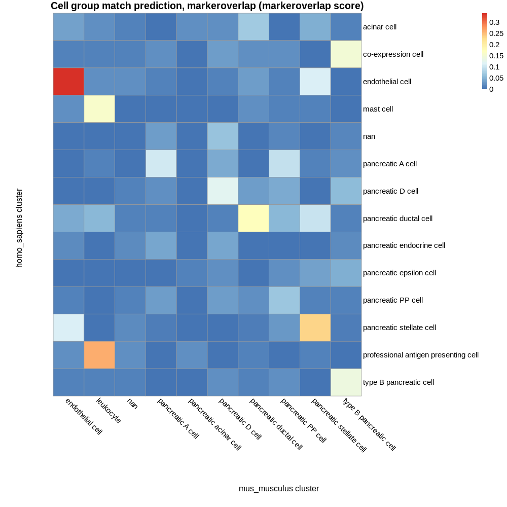
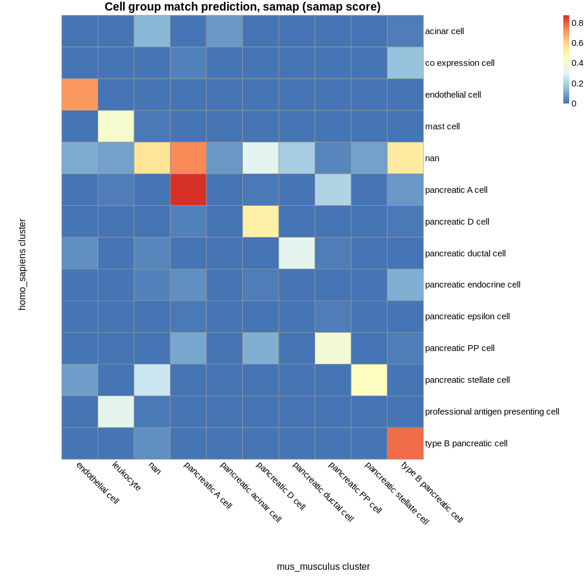

# Known composition of inputs

## E-MTAB-5061 pancreas cell types:

 - acinar cell  
 - co-expression cell  
 - endothelial cell  
 - mast cell  
 - nan  
 - pancreatic A cell  
 - pancreatic D cell  
 - pancreatic ductal cell  
 - pancreatic endocrine cell  
 - pancreatic epsilon cell  
 - pancreatic PP cell  
 - pancreatic stellate cell  
 - professional antigen presenting cell  
 - type B pancreatic cell  

## E-ENAD-15 pancreas cell types:

 - endothelial cell  
 - leukocyte  
 - nan  
 - pancreatic A cell  
 - pancreatic acinar cell  
 - pancreatic D cell  
 - pancreatic ductal cell  
 - pancreatic PP cell  
 - pancreatic stellate cell  
 - type B pancreatic cell  

## Common cell types:

 - endothelial cell  
 - nan  
 - pancreatic A cell  
 - pancreatic D cell  
 - pancreatic ductal cell  
 - pancreatic PP cell  
 - pancreatic stellate cell  
 - type B pancreatic cell  

# Cell group matches based on marker genes:

## Parameters  

 - Maximum p value: 1  
 - Minimum proportion overlap: 0.05  

## Results 

7 of 8 known intersecting cell types were predicted as top match by marker gene composition:  

endothelial cell  
pancreatic A cell  
pancreatic D cell  
pancreatic ductal cell  
pancreatic PP cell  
pancreatic stellate cell  
type B pancreatic cell  

7 of 8 known intersecting cell types were predicted as a match (at any rank).  

| homo_sapiens cluster | mus_musculus cluster | intersect_prop | intersect | intersect_gene_ids | intersect_gene_symbols |  
| --- | --- | --- | --- | --- | --- |
| endothelial cell | endothelial cell | 0.340659340659341 | 31 | ENSMUSG00000022018, ENSMUSG00000034845, ENSMUSG00000020717, ENSMUSG00000029648, ENSMUSG00000032766, ENSMUSG00000026814, ENSMUSG00000053477, ENSMUSG00000018593, ENSMUSG00000001946, ENSMUSG00000045092, ENSMUSG00000031502, ENSMUSG00000039167, ENSMUSG00000028517, ENSMUSG00000007872, ENSMUSG00000027293, ENSMUSG00000062960, ENSMUSG00000046916, ENSMUSG00000031207, ENSMUSG00000066026, ENSMUSG00000045930, ENSMUSG00000020044, ENSMUSG00000074457, ENSMUSG00000025810, ENSMUSG00000031503, ENSMUSG00000056492, ENSMUSG00000041134, ENSMUSG00000032035, ENSMUSG00000056313, ENSMUSG00000001029, ENSMUSG00000025492, ENSMUSG00000031871 | Rgcc, Plvap, Pecam1, Flt1, Gng11, Eng, Tcf4, Sparc, Esam, S1pr1, Col4a1, Adgrl4, Plpp3, Id3, Ehd4, Kdr, Myct1, Msn, Dhrs3, Clec14a, Timp3, S100a16, Nrp1, Col4a2, Adgrf5, Cyyr1, Ets1, Tcim, Icam2, Ifitm3, Cdh5 |  
| endothelial cell | pancreatic stellate cell | 0.10989010989011 | 10 | ENSMUSG00000032766, ENSMUSG00000018593, ENSMUSG00000001946, ENSMUSG00000031502, ENSMUSG00000007872, ENSMUSG00000025491, ENSMUSG00000020044, ENSMUSG00000031503, ENSMUSG00000070436, ENSMUSG00000025492 | Gng11, Sparc, Esam, Col4a1, Id3, Ifitm1, Timp3, Col4a2, Serpinh1, Ifitm3 |  
| professional antigen presenting cell | leukocyte | 0.261904761904762 | 22 | ENSMUSG00000030579, ENSMUSG00000003283, ENSMUSG00000022831, ENSMUSG00000000290, ENSMUSG00000073421, ENSMUSG00000029771, ENSMUSG00000037649, ENSMUSG00000028581, ENSMUSG00000024725, ENSMUSG00000024610, ENSMUSG00000089929, ENSMUSG00000022500, ENSMUSG00000032359, ENSMUSG00000030560, ENSMUSG00000058715, ENSMUSG00000071715, ENSMUSG00000026395, ENSMUSG00000020077, ENSMUSG00000021998, ENSMUSG00000040747, ENSMUSG00000041515, ENSMUSG00000002111 | Tyrobp, Hck, Hcls1, Itgb2, H2-Ab1, Irf5, H2-DMa, Laptm5, Ostf1, Cd74, Bcl2a1b, Litaf, Ctsh, Ctsc, Fcer1g, Ncf4, Ptprc, Srgn, Lcp1, Cd53, Irf8, Spi1 |  
| pancreatic stellate cell | pancreatic stellate cell | 0.23469387755102 | 23 | ENSMUSG00000031375, ENSMUSG00000026043, ENSMUSG00000031502, ENSMUSG00000018593, ENSMUSG00000070436, ENSMUSG00000031503, ENSMUSG00000004044, ENSMUSG00000030605, ENSMUSG00000022816, ENSMUSG00000032766, ENSMUSG00000067818, ENSMUSG00000029761, ENSMUSG00000042284, ENSMUSG00000028464, ENSMUSG00000038146, ENSMUSG00000020044, ENSMUSG00000020810, ENSMUSG00000028108, ENSMUSG00000018217, ENSMUSG00000025491, ENSMUSG00000031328, ENSMUSG00000031616, ENSMUSG00000050666 | Bgn, Col3a1, Col4a1, Sparc, Serpinh1, Col4a2, Cavin1, Mfge8, Fstl1, Gng11, Myl9, Cald1, Itga1, Tpm2, Notch3, Timp3, Cygb, Ecm1, Pmp22, Ifitm1, Flna, Ednra, Vstm4 |  
| pancreatic stellate cell | endothelial cell | 0.112244897959184 | 11 | ENSMUSG00000031502, ENSMUSG00000018593, ENSMUSG00000031503, ENSMUSG00000004044, ENSMUSG00000030605, ENSMUSG00000032766, ENSMUSG00000037060, ENSMUSG00000020044, ENSMUSG00000026814, ENSMUSG00000074364, ENSMUSG00000025810 | Col4a1, Sparc, Col4a2, Cavin1, Mfge8, Gng11, Cavin3, Timp3, Eng, Ehd2, Nrp1 |  
| pancreatic ductal cell | pancreatic ductal cell | 0.172043010752688 | 16 | ENSMUSG00000020911, ENSMUSG00000022132, ENSMUSG00000023232, ENSMUSG00000030342, ENSMUSG00000074457, ENSMUSG00000049521, ENSMUSG00000029994, ENSMUSG00000035910, ENSMUSG00000014329, ENSMUSG00000041959, ENSMUSG00000031451, ENSMUSG00000028716, ENSMUSG00000020679, ENSMUSG00000023043, ENSMUSG00000021127, ENSMUSG00000029304 | Krt19, Cldn10, Serinc2, Cd9, S100a16, Cdc42ep1, Anxa4, Dcdc2a, Bicc1, S100a10, Gas6, Pdzk1ip1, Hnf1b, Krt18, Zfp36l1, Spp1 |  
| pancreatic ductal cell | pancreatic stellate cell | 0.0967741935483871 | 9 | ENSMUSG00000028776, ENSMUSG00000023224, ENSMUSG00000025491, ENSMUSG00000027800, ENSMUSG00000025492, ENSMUSG00000031586, ENSMUSG00000031328, ENSMUSG00000021127, ENSMUSG00000032366 | Tinagl1, Serping1, Ifitm1, Tm4sf1, Ifitm3, Rbpms, Flna, Zfp36l1, Tpm1 |  
| pancreatic ductal cell | leukocyte | 0.0537634408602151 | 5 | ENSMUSG00000032359, ENSMUSG00000050335, ENSMUSG00000022500, ENSMUSG00000021127, ENSMUSG00000024610 | Ctsh, Lgals3, Litaf, Zfp36l1, Cd74 |  
| pancreatic ductal cell | pancreatic PP cell | 0.0537634408602151 | 5 | ENSMUSG00000034127, ENSMUSG00000041548, ENSMUSG00000037031, ENSMUSG00000030342, ENSMUSG00000029304 | Tspan8, Hspb8, Tspan15, Cd9, Spp1 |  
| mast cell | leukocyte | 0.159090909090909 | 14 | ENSMUSG00000028581, ENSMUSG00000020077, ENSMUSG00000058715, ENSMUSG00000033220, ENSMUSG00000030220, ENSMUSG00000026358, ENSMUSG00000026094, ENSMUSG00000031207, ENSMUSG00000021998, ENSMUSG00000040747, ENSMUSG00000028843, ENSMUSG00000030844, ENSMUSG00000006519, ENSMUSG00000026395 | Laptm5, Srgn, Fcer1g, Rac2, Arhgdib, Rgs1, Stk17b, Msn, Lcp1, Cd53, Sh3bgrl3, Rgs10, Cyba, Ptprc |  
| co-expression cell | type B pancreatic cell | 0.147368421052632 | 14 | ENSMUSG00000041681, ENSMUSG00000021587, ENSMUSG00000027984, ENSMUSG00000024027, ENSMUSG00000000215, ENSMUSG00000005232, ENSMUSG00000047591, ENSMUSG00000035187, ENSMUSG00000044453, ENSMUSG00000057069, ENSMUSG00000029644, ENSMUSG00000022315, ENSMUSG00000044156, ENSMUSG00000020788 | Iapp, Pcsk1, Hadh, Glp1r, Ins2, G6pc2, Mafa, Nkx6-1, Ffar1, Ero1lb, Pdx1, Slc30a8, Hepacam2, Atp2a3 |  
| type B pancreatic cell | type B pancreatic cell | 0.138297872340426 | 13 | ENSMUSG00000027984, ENSMUSG00000021587, ENSMUSG00000041681, ENSMUSG00000005232, ENSMUSG00000029644, ENSMUSG00000000215, ENSMUSG00000035187, ENSMUSG00000047591, ENSMUSG00000024027, ENSMUSG00000057069, ENSMUSG00000044453, ENSMUSG00000020788, ENSMUSG00000022315 | Hadh, Pcsk1, Iapp, G6pc2, Pdx1, Ins2, Nkx6-1, Mafa, Glp1r, Ero1lb, Ffar1, Atp2a3, Slc30a8 |  
| pancreatic D cell | pancreatic D cell | 0.120879120879121 | 11 | ENSMUSG00000024990, ENSMUSG00000004366, ENSMUSG00000026360, ENSMUSG00000033676, ENSMUSG00000090223, ENSMUSG00000022577, ENSMUSG00000022829, ENSMUSG00000030701, ENSMUSG00000012350, ENSMUSG00000026579, ENSMUSG00000027004 | Rbp4, Sst, Rgs2, Gabrb3, Pcp4, Ly6h, Stxbp5l, Plekhb1, Ehf, F5, Frzb |  
| pancreatic D cell | type B pancreatic cell | 0.0549450549450549 | 5 | ENSMUSG00000021587, ENSMUSG00000027984, ENSMUSG00000044156, ENSMUSG00000061601, ENSMUSG00000027004 | Pcsk1, Hadh, Hepacam2, Pclo, Frzb |  
| pancreatic A cell | pancreatic A cell | 0.105263157894737 | 10 | ENSMUSG00000031596, ENSMUSG00000026103, ENSMUSG00000035540, ENSMUSG00000006546, ENSMUSG00000001504, ENSMUSG00000073530, ENSMUSG00000018339, ENSMUSG00000074622, ENSMUSG00000035277, ENSMUSG00000031099 | Slc7a2, Gls, Gc, Cryba2, Irx2, Pappa2, Gpx3, Mafb, Arx, Smarca1 |  
| pancreatic A cell | pancreatic PP cell | 0.0947368421052632 | 9 | ENSMUSG00000035540, ENSMUSG00000073530, ENSMUSG00000018339, ENSMUSG00000001542, ENSMUSG00000035277, ENSMUSG00000040412, ENSMUSG00000055197, ENSMUSG00000021700, ENSMUSG00000031099 | Gc, Pappa2, Gpx3, Ell2, Arx, 5330417C22Rik, Fev, Rab3c, Smarca1 |  
| acinar cell | pancreatic ductal cell | 0.0714285714285714 | 6 | ENSMUSG00000008540, ENSMUSG00000021127, ENSMUSG00000049521, ENSMUSG00000024646, ENSMUSG00000047797, ENSMUSG00000022270 | Mgst1, Zfp36l1, Cdc42ep1, Cyb5a, Gjb1, Retreg1 |  
| pancreatic PP cell | pancreatic PP cell | 0.0652173913043478 | 6 | ENSMUSG00000004151, ENSMUSG00000017316, ENSMUSG00000035277, ENSMUSG00000030701, ENSMUSG00000001901, ENSMUSG00000028222 | Etv1, Ppy, Arx, Plekhb1, Kcnh6, Calb1 |  
| nan | pancreatic D cell | 0.0615384615384615 | 4 | ENSMUSG00000031517, ENSMUSG00000004366, ENSMUSG00000017316, ENSMUSG00000051359 | Gpm6a, Sst, Ppy, Ncald |  

# Cell group matches based on SAMap results:

## Parameters  

 - SAMap minimum score threshold: 0.05  

## Results 

7 of 8 known intersecting cell types were predicted as top match by marker gene composition:  

endothelial cell  
pancreatic A cell  
pancreatic D cell  
pancreatic ductal cell  
pancreatic PP cell  
pancreatic stellate cell  
type B pancreatic cell  

8 of 8 known intersecting cell types were predicted as a match (at any rank).  

| homo_sapiens cluster | mus_musculus cluster | score |  
| --- | --- | --- |
| pancreatic A cell | pancreatic A cell | 0.87314127390577 |  
| type B pancreatic cell | type B pancreatic cell | 0.771865251255106 |  
| nan | pancreatic A cell | 0.729898057270614 |  
| endothelial cell | endothelial cell | 0.706682954786343 |  
| nan | nan | 0.552426853758236 |  
| nan | type B pancreatic cell | 0.523946182898424 |  
| pancreatic D cell | pancreatic D cell | 0.510673679515832 |  
| pancreatic stellate cell | pancreatic stellate cell | 0.435868586217356 |  
| mast cell | leukocyte | 0.399944670569797 |  
| pancreatic PP cell | pancreatic PP cell | 0.380872518888639 |  
| professional antigen presenting cell | leukocyte | 0.319061018542821 |  
| pancreatic ductal cell | pancreatic ductal cell | 0.317460260263836 |  
| nan | pancreatic D cell | 0.305896442599365 |  
| pancreatic stellate cell | nan | 0.258603898693689 |  
| pancreatic A cell | pancreatic PP cell | 0.201823986576386 |  
| nan | pancreatic ductal cell | 0.185606965432483 |  
| co expression cell | type B pancreatic cell | 0.158483771200816 |  
| acinar cell | nan | 0.139479245512517 |  
| pancreatic endocrine cell | type B pancreatic cell | 0.120646788367365 |  
| pancreatic PP cell | pancreatic D cell | 0.117119215744219 |  
| nan | endothelial cell | 0.105399606608012 |  
| pancreatic PP cell | pancreatic A cell | 0.0974257849639437 |  
| nan | leukocyte | 0.0927222773947555 |  
| nan | pancreatic stellate cell | 0.0914264312128403 |  
| pancreatic stellate cell | endothelial cell | 0.0813064207156411 |  
| nan | pancreatic acinar cell | 0.0717385903993541 |  
| acinar cell | pancreatic acinar cell | 0.0712865994151503 |  
| pancreatic A cell | type B pancreatic cell | 0.0702281934357028 |  
| pancreatic ductal cell | endothelial cell | 0.0601483702186448 |  
| pancreatic endocrine cell | pancreatic A cell | 0.0591364177353591 |  
| type B pancreatic cell | nan | 0.0539182706178796 |  
