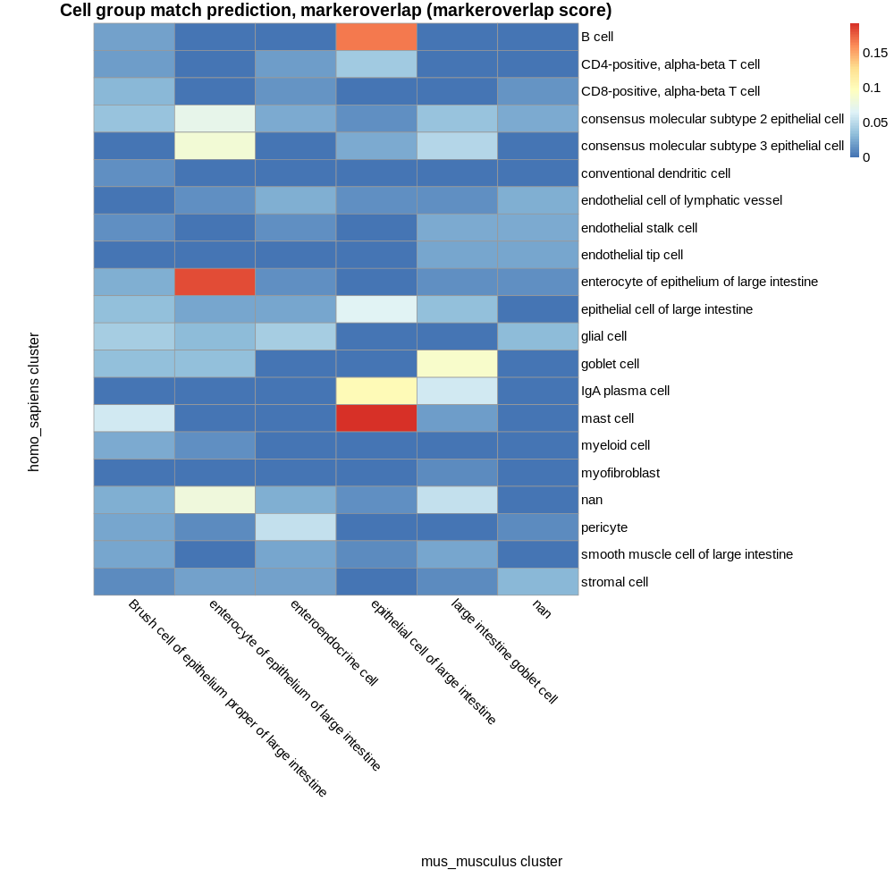
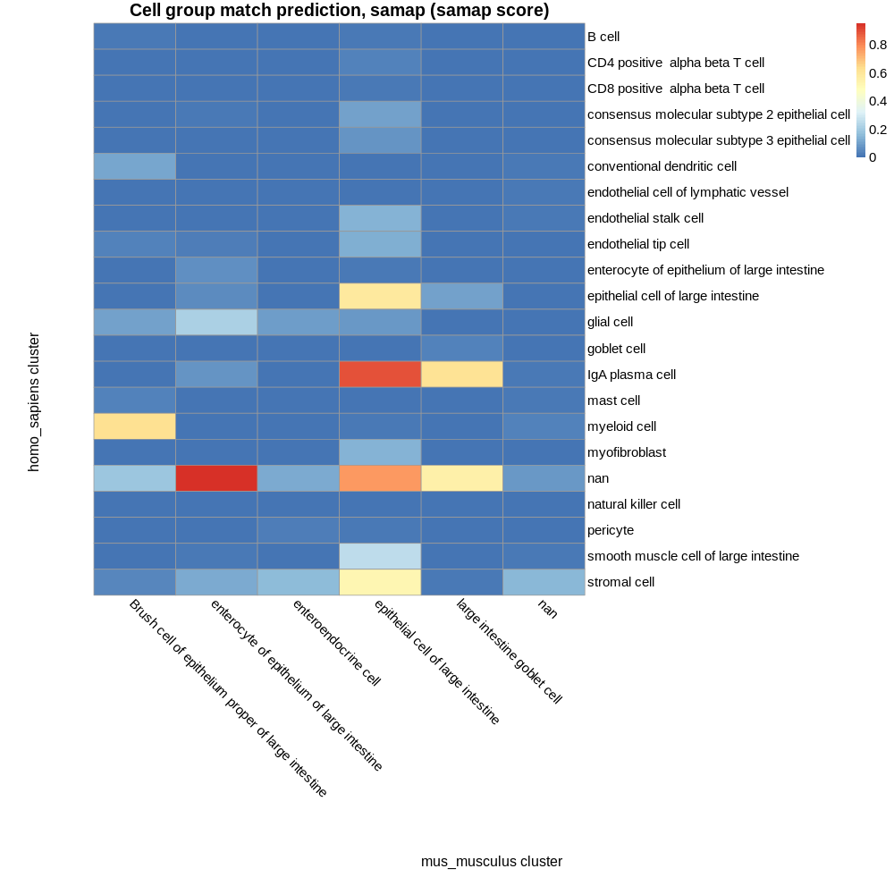

# Known composition of inputs

## E-MTAB-8410 ascending_colon cell types:

 - B cell  
 - CD4-positive, alpha-beta T cell  
 - CD8-positive, alpha-beta T cell  
 - consensus molecular subtype 2 epithelial cell  
 - consensus molecular subtype 3 epithelial cell  
 - conventional dendritic cell  
 - endothelial cell of lymphatic vessel  
 - endothelial stalk cell  
 - endothelial tip cell  
 - enterocyte of epithelium of large intestine  
 - epithelial cell of large intestine  
 - glial cell  
 - goblet cell  
 - IgA plasma cell  
 - mast cell  
 - myeloid cell  
 - myofibroblast  
 - nan  
 - natural killer cell  
 - pericyte  
 - smooth muscle cell of large intestine  
 - stromal cell  

## E-ENAD-15 ascending_colon cell types:

 - Brush cell of epithelium proper of large intestine  
 - enterocyte of epithelium of large intestine  
 - enteroendocrine cell  
 - epithelial cell of large intestine  
 - large intestine goblet cell  
 - nan  

## Common cell types:

 - enterocyte of epithelium of large intestine  
 - epithelial cell of large intestine  
 - nan  

# Cell group matches based on marker genes:

## Parameters  

 - Maximum p value: 1  
 - Minimum proportion overlap: 0.05  

## Results 

2 of 3 known intersecting cell types were predicted as top match by marker gene composition:  

enterocyte of epithelium of large intestine  
epithelial cell of large intestine  

2 of 3 known intersecting cell types were predicted as a match (at any rank).  

| homo_sapiens cluster | mus_musculus cluster | intersect_prop | intersect | intersect_gene_ids | intersect_gene_symbols |  
| --- | --- | --- | --- | --- | --- |
| mast cell | epithelial cell of large intestine | 0.192307692307692 | 10 | ENSMUSG00000071415, ENSMUSG00000028081, ENSMUSG00000060636, ENSMUSG00000058600, ENSMUSG00000030744, ENSMUSG00000090862, ENSMUSG00000025794, ENSMUSG00000031320, ENSMUSG00000012848, ENSMUSG00000039001 | Rpl23, Rps3a1, Rpl35a, Rpl30, Rps3, Rps13, Rpl14, Rps4x, Rps5, Rps21 |  
| mast cell | Brush cell of epithelium proper of large intestine | 0.0576923076923077 | 3 | ENSMUSG00000005672, ENSMUSG00000051079, ENSMUSG00000020377 | Kit, Rgs13, Ltc4s |  
| enterocyte of epithelium of large intestine | enterocyte of epithelium of large intestine | 0.181818181818182 | 14 | ENSMUSG00000000805, ENSMUSG00000035775, ENSMUSG00000023247, ENSMUSG00000064254, ENSMUSG00000029201, ENSMUSG00000030587, ENSMUSG00000020777, ENSMUSG00000050335, ENSMUSG00000031844, ENSMUSG00000027456, ENSMUSG00000027317, ENSMUSG00000029269, ENSMUSG00000030739, ENSMUSG00000035852 | Car4, Krt20, Guca2a, Ethe1, Ugdh, 2200002D01Rik, Acox1, Lgals3, Hsd17b2, Sdcbp2, Ppp1r14d, Sult1b1, Myh14, Misp |  
| B cell | epithelial cell of large intestine | 0.166666666666667 | 8 | ENSMUSG00000025967, ENSMUSG00000058600, ENSMUSG00000028936, ENSMUSG00000039001, ENSMUSG00000061787, ENSMUSG00000029614, ENSMUSG00000090862, ENSMUSG00000020372 | Eef1b2, Rpl30, Rpl22, Rps21, Rps17, Rpl6, Rps13, Rack1 |  
| IgA plasma cell | epithelial cell of large intestine | 0.101449275362319 | 7 | ENSMUSG00000060036, ENSMUSG00000003970, ENSMUSG00000040952, ENSMUSG00000044533, ENSMUSG00000031320, ENSMUSG00000028495, ENSMUSG00000061787 | Rpl3, Rpl8, Rps19, Rps2, Rps4x, Rps6, Rps17 |  
| IgA plasma cell | large intestine goblet cell | 0.0579710144927536 | 4 | ENSMUSG00000031770, ENSMUSG00000020484, ENSMUSG00000038991, ENSMUSG00000075701 | Herpud1, Xbp1, Txndc5, Selenos |  
| goblet cell | large intestine goblet cell | 0.0898876404494382 | 8 | ENSMUSG00000033200, ENSMUSG00000026961, ENSMUSG00000013523, ENSMUSG00000026994, ENSMUSG00000020577, ENSMUSG00000024029, ENSMUSG00000021749, ENSMUSG00000020581 | Tpsg1, Lrrc26, Bcas1, Galnt3, Tspan13, Tff3, Oit1, Agr2 |  
| consensus molecular subtype 3 epithelial cell | enterocyte of epithelium of large intestine | 0.0833333333333333 | 7 | ENSMUSG00000027456, ENSMUSG00000029269, ENSMUSG00000023057, ENSMUSG00000035852, ENSMUSG00000057963, ENSMUSG00000064254, ENSMUSG00000030587 | Sdcbp2, Sult1b1, Fabp2, Misp, Itpk1, Ethe1, 2200002D01Rik |  
| nan | enterocyte of epithelium of large intestine | 0.0789473684210526 | 6 | ENSMUSG00000030587, ENSMUSG00000025497, ENSMUSG00000035852, ENSMUSG00000068874, ENSMUSG00000030739, ENSMUSG00000029727 | 2200002D01Rik, Cdhr5, Misp, Selenbp1, Myh14, Cyp3a13 |  
| nan | large intestine goblet cell | 0.0526315789473684 | 4 | ENSMUSG00000027513, ENSMUSG00000020581, ENSMUSG00000021749, ENSMUSG00000057092 | Pck1, Agr2, Oit1, Fxyd3 |  
| consensus molecular subtype 2 epithelial cell | enterocyte of epithelium of large intestine | 0.0714285714285714 | 6 | ENSMUSG00000078439, ENSMUSG00000035775, ENSMUSG00000047040, ENSMUSG00000027317, ENSMUSG00000030587, ENSMUSG00000035852 | Smim24, Krt20, Prr15l, Ppp1r14d, 2200002D01Rik, Misp |  
| epithelial cell of large intestine | epithelial cell of large intestine | 0.0666666666666667 | 6 | ENSMUSG00000042808, ENSMUSG00000061718, ENSMUSG00000025980, ENSMUSG00000024597, ENSMUSG00000018446, ENSMUSG00000008540 | Gpx2, Ppp1r1b, Hspd1, Slc12a2, C1qbp, Mgst1 |  
| pericyte | enteroendocrine cell | 0.0531914893617021 | 5 | ENSMUSG00000037852, ENSMUSG00000052727, ENSMUSG00000014846, ENSMUSG00000026728, ENSMUSG00000028214 | Cpe, Map1b, Tppp3, Vim, Gem |  

# Cell group matches based on SAMap results:

## Parameters  

 - SAMap minimum score threshold: 0.05  

## Results 

2 of 3 known intersecting cell types were predicted as top match by marker gene composition:  

enterocyte of epithelium of large intestine  
epithelial cell of large intestine  

3 of 3 known intersecting cell types were predicted as a match (at any rank).  

| homo_sapiens cluster | mus_musculus cluster | score |  
| --- | --- | --- |
| nan | enterocyte of epithelium of large intestine | 0.955964056816414 |  
| IgA plasma cell | epithelial cell of large intestine | 0.896370210243906 |  
| nan | epithelial cell of large intestine | 0.766760269126279 |  
| myeloid cell | Brush cell of epithelium proper of large intestine | 0.623202258133555 |  
| IgA plasma cell | large intestine goblet cell | 0.612208562128838 |  
| epithelial cell of large intestine | epithelial cell of large intestine | 0.590422022914332 |  
| nan | large intestine goblet cell | 0.544903566128002 |  
| stromal cell | epithelial cell of large intestine | 0.522087653811292 |  
| smooth muscle cell of large intestine | epithelial cell of large intestine | 0.254437365110581 |  
| glial cell | enterocyte of epithelium of large intestine | 0.218370734437705 |  
| nan | Brush cell of epithelium proper of large intestine | 0.18205310715055 |  
| stromal cell | enteroendocrine cell | 0.161350767227504 |  
| stromal cell | nan | 0.144332829366341 |  
| endothelial stalk cell | epithelial cell of large intestine | 0.140143755793678 |  
| myofibroblast | epithelial cell of large intestine | 0.135611344875452 |  
| endothelial tip cell | epithelial cell of large intestine | 0.132238260292573 |  
| stromal cell | enterocyte of epithelium of large intestine | 0.122317225349848 |  
| nan | enteroendocrine cell | 0.117673230431141 |  
| conventional dendritic cell | Brush cell of epithelium proper of large intestine | 0.1053087211489 |  
| epithelial cell of large intestine | large intestine goblet cell | 0.0988290714264394 |  
| glial cell | Brush cell of epithelium proper of large intestine | 0.0959634783629903 |  
| consensus molecular subtype 2 epithelial cell | epithelial cell of large intestine | 0.095936636495523 |  
| glial cell | enteroendocrine cell | 0.0901719339878732 |  
| nan | nan | 0.0856757003131718 |  
| glial cell | epithelial cell of large intestine | 0.0846308905683404 |  
| consensus molecular subtype 3 epithelial cell | epithelial cell of large intestine | 0.0741692112206865 |  
| IgA plasma cell | enterocyte of epithelium of large intestine | 0.068121239707791 |  
| enterocyte of epithelium of large intestine | enterocyte of epithelium of large intestine | 0.061332020424735 |  
