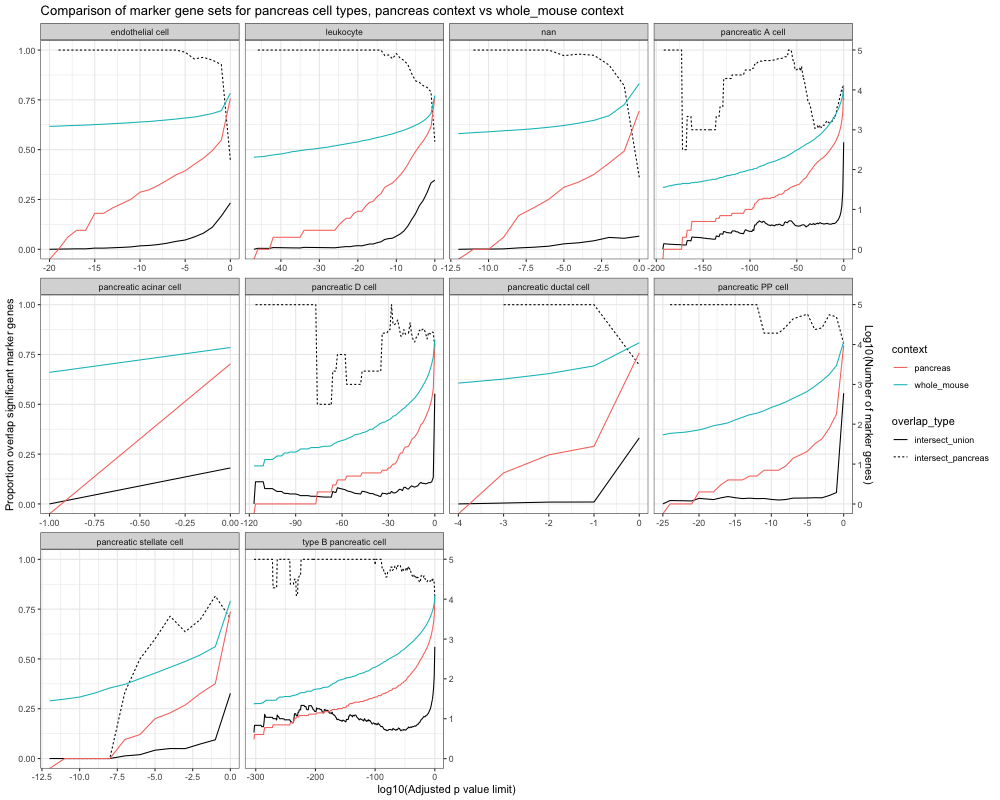
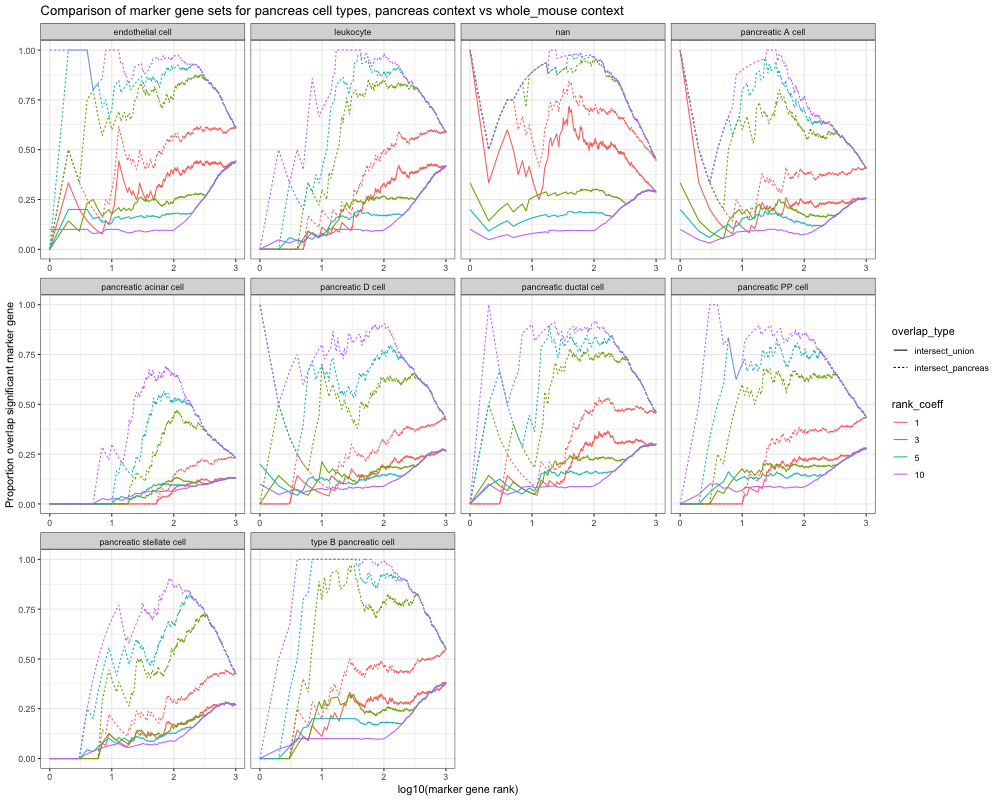

# Markers are defined in specific contexts

When using marker gene sets for downstream inference, it's important to remember that they are usually derived in specific contexts, often wihin an expeirment and against the background of other cell types present there. This means that the marker gene set will be different for example cell type A depending on whether they've been derived for whole organisms, tissues, or cell isolates. 

To illustrate this point, we derived marker gene sets for cell types from the pancreas in Tabula Muris, comparing against a) the rest of the pancreas and b) all other cell types in the mouse (including those from a)). We applied a range of thresholds for adjusted p value and examined the impact this had on the proportion of intersecting genes between the two contexts.

## Results  

## Intersect of marker gene sets between contexts across the adjusted p value range

The above figure shows how the number of differential (marker) genes and intersecting proportions between contexts evolves as the p value threshold is relaxed. This is shown for two 'denominator' values- the union of the two gene sets, and the smaller of the two input contexts - in this case pancreas. 

The key points to note are:

 - Some cell types have few differential genes even at high p value thresholds, e.g. acinar cells
 - The Proportion of intersect tends towards 1 as the p value threshold is relaxed
 - Many more marker genes result from a whole mouse context than the pancreas-specific context. This makes sense: we can expect that pancreas cell types are more similar to other pancreas cell types than they are to cells from other organ systems. 
 - Some cell types have non-trivial intersects across the p value range (e.g. type B pancreatic cell) implying there are context-independent marker genes, but since even at high stringency the overall intersect is low (< 0.2), this set could not be identified from either marker set alone.
 - In many cases the most significant genes in the smaller context (pancreas in this example) are a subset of those in the wider context at the same p value. 
 - Some cell types only develop significant intersect at low stringency (e.g. pancreatic PP cell), indicating that the marker genes are more context specific. 
 - The drop in the intersect_pancreas trace for e.g. A cells and D cells suggests that there are highly significant marker genes not shared between contexts for those cell types. 

## Intersect of top-ranked gene sets

As an alternative view, we can examine the intersect between the top N genes between contexts:

This plot shows the intersection between marker gene sets of the same rank (rank coeff = 1), and different ranks (rank coeff > 1), allowing for a more permissive comparison. For example, at a coefficient of 3 we're examining how many of e.g. the top 10 genes of the pancreas context are present in the top 30 genes of the whole mouse context. 

Many cell types show high ( ~ 75\% or above) agreement between ranked marker gene sets over a wide range of ranks at relatively modest rank coefficients (see e.g. endothelial cells,  leukocytes, D cells, ductal cells, PP cells, and especially B cells), indicating robust marker gene sets. Some types (e.g. A cells, stellate cells) agree only at higher ranks, suggesting context specificity, in agreement with the plots in the section above. 

## Conclusions

 - Wider contexts produce longer differential gene lists.
 - Marker genes derived from narrow contexts largely persist in the marker gene sets for wider contexts (but not vice versa), so it may be possible to infer 'upwards' applicability of marker gene sets. 
 - Extent and character of agreement between marker contexts is specific to the cell types concerned. 

In all cases care should be taken to state clearly the context in which marker gene sets are derived. 

